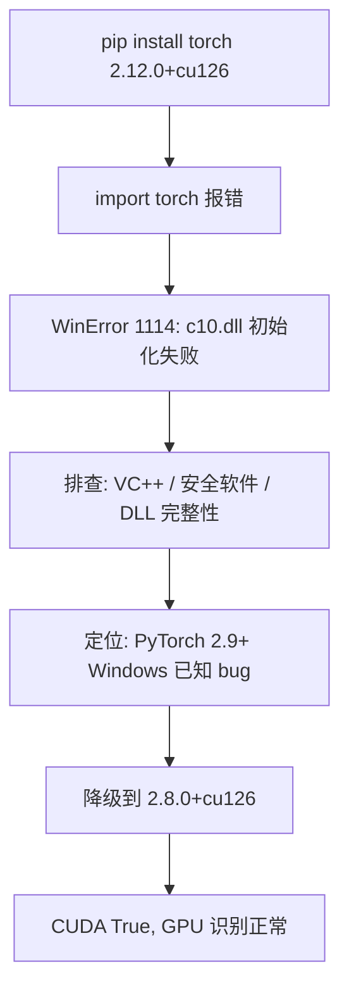

> **一句话总结**：在 Win11 + RTX 4060 环境下，PyTorch 2.12.0 的 `import torch` 报错 `WinError 1114`。折腾半天发现是 2.9+ 版本在 Windows 上的已知 Bug，**降级到 2.8.0** 后瞬间满血复活。

---

## “案发现场”

如果你和我一样，是 Windows + Anaconda + NVIDIA 显卡的组合，遇到类似的 DLL 报错，大概率可以参考本文的解决思路。

| 项目 | 配置详情 |
| :--- | :--- |
| **操作系统** | Windows 11 |
| **Python 环境** | Python 3.12.4 (conda base) |
| **显卡** | NVIDIA GeForce RTX 4060 Laptop |
| **驱动/CUDA** | 驱动 581.15，`nvidia-smi` 显示 CUDA 13.0 |
| **安装源** | PyTorch 官方 cu126 (需网络代理) |

---

## 踩坑过程

### 第一次安装：看起来一切正常

我打开 [PyTorch 官网 Get Started](https://pytorch.org/get-started/locally/)，按配置选择了：

- **OS**: Windows
- **Package**: Pip
- **Language**: Python
- **Compute Platform**: CUDA 12.6

然后开了 VPN（国内访问 `download.pytorch.org` 需要），在 Anaconda Prompt 里执行：

```bash
conda activate base
pip install torch torchvision torchaudio --index-url https://download.pytorch.org/whl/cu126
```

`pip` 安装过程没有报错，最终装上了：

| 包名 | 版本 |
|------|------|
| torch | 2.12.0+cu126 |
| torchvision | 0.27.0+cu126 |
| torchaudio | 2.11.0+cu126 |

安装过程风平浪静，没有任何报错。`pip` 成功安装了 `2.12.0+cu126` 版本。此时的我以为，我已经完成了所有工作。

### 残酷的验证时刻

然而，当我满怀期待地运行验证命令时，现实给了我当头一棒：

```bash
python -c "import torch; print(torch.__version__)"
```

直接报错：

```
OSError: [WinError 1114] 动态链接库(DLL)初始化例程失败。
Error loading "D:\develop\Anaconda3\Lib\site-packages\torch\lib\c10.dll" or one of its dependencies.
```

这意味着，PyTorch 的核心动态链接库加载失败了。

### 我一开始以为的问题（都是弯路）

看到 DLL 报错，我本能地陷入了“自我怀疑”模式，尝试了各种常规手段：

- **检查文件**：去目录下翻了个底朝天，`c10.dll` 文件明明就在那里，大小也没问题。
- **检查驱动**：`nvidia-smi` 显示正常，驱动版本也足够新。
- **检查运行库**：VC++ 运行库、系统 DLL 依赖似乎也都齐全。
- **检查版本**：反复确认安装的是 `+cu126` 后缀的 GPU 版本，不是 CPU 版。

**结论**：这些常规手段对我无效。问题不在“安装步骤”，而在**版本本身**。

### 真正原因：PyTorch 2.9+ 的 Windows DLL 兼容 bug

查阅 PyTorch GitHub Issues 后发现，从 **2.9.0** 起，Windows 上大量用户遇到相同的 `WinError 1114` 报错：

- [Issue #166628](https://github.com/pytorch/pytorch/issues/166628) — `c10.dll` 初始化失败
- [Issue #169429](https://github.com/pytorch/pytorch/issues/169429) — `torch_python.dll` 初始化失败

社区普遍认可的临时方案是：**降级到 2.8.0**。这不是安装姿势不对，而是 2.9 ~ 2.12 在 Windows 上的兼容性缺陷。

整个排查过程可以用下图概括：



---

## 解决方案（可直接跟着做）

### 开 VPN

确保浏览器能打开 `https://download.pytorch.org`。PyTorch 官方 wheel 包体约 2~3 GB，下载需要稳定网络。(也可以使用国内镜像源)

### 卸载坏版本

```bash
conda activate base
pip uninstall torch torchvision torchaudio -y
```

### 安装稳定 GPU 版

```bash
pip install torch==2.8.0 torchvision==0.23.0 torchaudio==2.8.0 --index-url https://download.pytorch.org/whl/cu126
```

如果下载慢或超时，可以加超时参数，中断后重跑同一条命令即可：

```bash
pip install torch==2.8.0 torchvision==0.23.0 torchaudio==2.8.0 --index-url https://download.pytorch.org/whl/cu126 --timeout 600
```

### 验证安装

建议用英文输出，避免 Windows 终端中文编码问题：

```bash
python -c "import torch; print('version:', torch.__version__); print('cuda:', torch.cuda.is_available()); print('gpu:', torch.cuda.get_device_name(0))"
```

我最终的输出：

```
version: 2.8.0+cu126
cuda: True
gpu: NVIDIA GeForce RTX 4060 Laptop GPU
```

再做一个 GPU 张量测试，确认显卡真的能参与计算：

```bash
python -c "import torch; x = torch.randn(3, 3).cuda(); print('device:', x.device)"
```

输出 `device: cuda:0` 即表示 GPU 计算正常。

---

## 延伸知识：三个容易混淆的「CUDA」

安装过程中我最困惑的一点是：`nvidia-smi` 显示 CUDA 13.0，但 PyTorch 装的是 cu126（12.6）。这两者到底是什么关系？

| 概念 | 含义 | 我的情况 |
|------|------|---------|
| 驱动 CUDA 版本 | `nvidia-smi` 右上角显示的数字，表示驱动支持的 CUDA **上限** | 13.0 |
| PyTorch 内置 CUDA | 版本号里的 `+cu126`，随 pip 包装进来的 CUDA **运行时** | 12.6，无需单独装 CUDA Toolkit |
| CPU 版 vs GPU 版 | 版本号有无 `+cu` 后缀 | 必须选 `+cu126` 才能用显卡 |

关键规则只有一条：

> **驱动支持的 CUDA 版本 ≥ PyTorch 内置的 CUDA 版本** 即可。

我的驱动支持 13.0，PyTorch 内置 12.6，完全兼容。不需要追求「驱动是 13.0 就装 cu130」——PyTorch 官方目前还没有对应的 wheel。

### GPU 版和 CPU 版的使用区别

代码写法几乎一样，核心差别是 **速度** 和 **能不能把张量放到显卡上**：

```python
import torch

# 默认在 CPU 上
x = torch.randn(1000, 1000)

# GPU 版可以这样放到显卡（CPU 版不支持）
device = torch.device("cuda" if torch.cuda.is_available() else "cpu")
x = torch.randn(1000, 1000).to(device)
```

注意：装了 GPU 版也 **不会自动用显卡**，需要手动 `.cuda()` 或 `.to("cuda")`。对小脚本差别不大，但训练深度学习模型时，GPU 版通常比 CPU 快一个数量级以上。

---

## 若降级后仍失败：备选排查

降级到 2.8.0 后绝大多数情况能直接解决。如果仍然报错，可以依次尝试：

1. **安装 VC++ 运行库** — [Microsoft Visual C++ 2015-2022 Redistributable (x64)](https://learn.microsoft.com/zh-cn/cpp/windows/latest-supported-vc-redist)，安装后重启
2. **检查安全软件** — 火绒、360 等可能拦截 `torch\lib\` 下的 DLL 加载，将 Anaconda 安装目录加入信任列表
3. **避免 import 顺序冲突** — 若项目同时用了 PyQt，确保 `import torch` 在 PyQt 之前
4. **重启电脑** — 驱动或运行库更新后，有时需要重启才能生效

---

## 经验总结

- **Windows 用户注意**：在官方修复 Bug 前，**2.8.0** 是目前最稳的选择，不要盲目追新。
- **认准后缀**：一定要安装带 `+cu126` 后缀的版本，否则无法使用 GPU。
- **网络准备**：官方源在国内通常需要代理，包体较大（2~3 GB），请耐心等待。
- **报错关键词**：遇到 `WinError 1114` + `c10.dll`，直接降级，不要在同一个坑里反复摔倒。

---

## 参考链接

- [PyTorch 官方安装页](https://pytorch.org/get-started/locally/)
- [GitHub Issue #166628 — WinError 1114 on Windows](https://github.com/pytorch/pytorch/issues/166628)
- [GitHub Issue #169429 — DLL failure from torch 2.9.0](https://github.com/pytorch/pytorch/issues/169429)
- [Microsoft VC++ Redistributable 下载](https://learn.microsoft.com/zh-cn/cpp/windows/latest-supported-vc-redist)

*希望这篇记录能帮你少走弯路！*