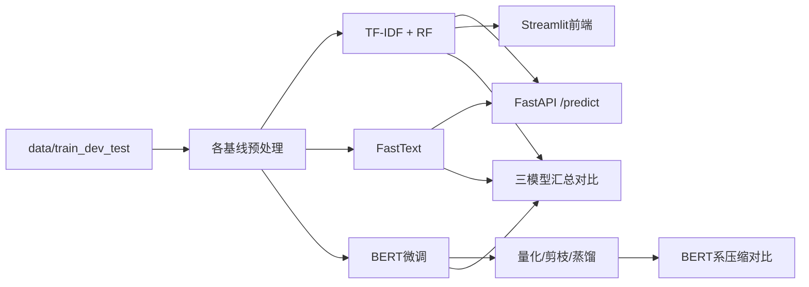
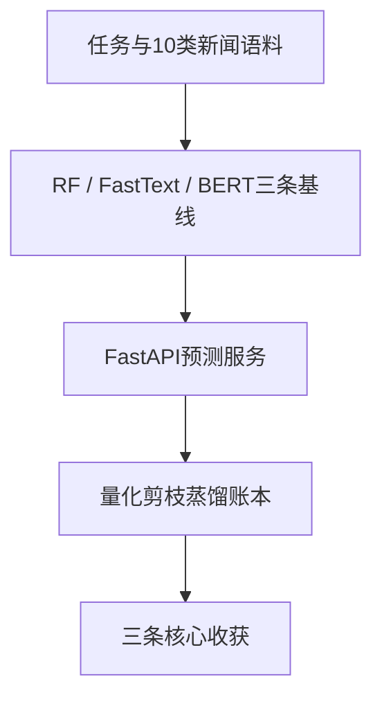

> 本文基于中文新闻语料，完整走通「数据预处理 → 多基线训练 → 评估对比 → FastAPI 预测」的文本分类 pipeline。BERT 在官方 test 上准确率约 **94%**；FastText 在官方 dev 上约 **90.9%**；TF-IDF + 随机森林在 train 留出集上约 **80.5%**（三者评估集不同，见后文）。读完后你应能理解：经典特征和预训练模型各自怎么接进同一任务、train/serve 预处理为何必须一致，以及量化/剪枝/蒸馏在体积–速度–精度上各自换了什么。

---

## 要解决什么问题？

给定一段**中文新闻正文**，判断它属于下面 10 个类别中的哪一个：

| 索引 | 类别 |
|------|------|
| 0 | finance |
| 1 | realty |
| 2 | stocks |
| 3 | education |
| 4 | science |
| 5 | society |
| 6 | politics |
| 7 | sports |
| 8 | game |
| 9 | entertainment |

| 项目 | 说明 |
|------|------|
| 任务类型 | **多分类**（10 个类别） |
| 训练集 | 180000 条（`data/train.txt`） |
| 验证集 | 10000 条（`data/dev.txt`） |
| 测试集 | 10000 条（`data/test.txt`） |
| 数据格式 | Tab 分隔：`文本\t标签`（标签为 0–9） |
| 评估指标 | Accuracy / Precision / Recall / F1 |

与上一篇 [CIFAR-10 图像分类](PyTorch_CIFAR10图像分类_CNN实战.md) 对比：

| 对比项 | CIFAR-10 | NewsCompass |
|--------|----------|-------------|
| 输入 | 3×32×32 图像张量 | 不定长中文文本 |
| 基线模型 | CNN | TF-IDF+RF / FastText / BERT |
| 特征 | 卷积自动提 | 词袋/字符 / 子词 Embedding |
| 输出 | 10 类 logits | 10 类标签（+ 概率） |
| 额外交付 | checkpoint | FastAPI `/predict`、压缩对比 |

---

## 整体流程概览



典型命令（均在项目根目录 `NewsCompass/` 执行）：

```bash
# RF
python baseline_rf_tfidf/dataEDA_Processing.py
python baseline_rf_tfidf/rf_train.py
python baseline_rf_tfidf/api.py

# FastText
python baseline_fasttext/data_preprocess.py
python baseline_fasttext/fasttext_char_1_default.py

# BERT
python bert/train.py
python bert/eval.py

# 对比
python generate_model_comparison.py
python model_comparison/compare_models.py
```

---

## 项目目录（三条基线各自独立）

```
NewsCompass/
├── data/                   # 原始语料、停用词、各类预处理产物
├── analysis/               # 数据集检查与可视化
├── baseline_rf_tfidf/      # TF-IDF + 随机森林 + API + Streamlit
├── baseline_fasttext/      # FastText + API
├── bert/                   # 微调、量化、剪枝、硬/软蒸馏
├── bert-base-chinese/      # 本地预训练资源
├── model_comparison/       # BERT 系体积/速度/精度对比
└── generate_model_comparison.py
```

每条基线有自己的 `config.py`，路径约定相对项目根，避免互相覆盖输出。

---

## RF 基线：分词 → TF-IDF → 随机森林

### 预处理：`dataEDA_Processing.py`

用 jieba 分词，结果写进 `words` 列，空格拼接后存 CSV。**停用词不在这一步删**（原因见第十二节踩坑）：

```python
def tokenize_text(df):
    def _cut(text):
        if pd.isna(text):
            return ""
        words = [w.strip() for w in jieba.cut(str(text)) if w.strip()]
        return " ".join(words)

    df = df.copy()
    df["words"] = df["text"].apply(_cut)
    return df
```

### 特征与训练：`rf_train.py`

```python
tfidf = TfidfVectorizer(
    max_features=20000,
    min_df=2,
    tokenizer=space_tokenizer,
    token_pattern=None,
    stop_words=list(load_stopwords()),  # 停用词挂在向量器上
)
features = tfidf.fit_transform(df["words"])

x_train, x_test, y_train, y_test = train_test_split(
    features, df["label"], test_size=0.2, random_state=42
)

model = RandomForestClassifier(
    n_estimators=100, n_jobs=-1, random_state=42
)
model.fit(x_train, y_train)
```

| 参数 | 值 | 说明 |
|------|-----|------|
| `max_features` | 20000 | TF-IDF 词表上限 |
| `min_df` | 2 | 至少出现在 2 篇文档 |
| `n_estimators` | 100 | 树的数量 |
| 划分 | train 80% / 留出 20% | 注意：不是官方 `test.txt` |

模型和 `TfidfVectorizer` 一起 pickle 落盘，推理必须复用**同一个**向量器。

### 预测接口：`rf_predict_fun.py` + `api.py`

推理只分词，停用词交给已保存的 vectorizer：

```python
words = " ".join(w.strip() for w in jieba.cut(str(data["text"])) if w.strip())
feature = _vectorizer.transform([words])
proba = _model.predict_proba(feature)[0]
top3 = sorted(enumerate(proba), key=lambda x: x[1], reverse=True)[:3]
```

启动：

```bash
python baseline_rf_tfidf/api.py
# 浏览器打开 http://127.0.0.1:8000/docs
# POST /predict  body: {"text": "今天股市大涨"}
```

返回 Top 3 类别及概率。需要页面演示时再开：

```bash
streamlit run baseline_rf_tfidf/app.py
```

---

## FastText 基线：字符级清洗 → 监督学习格式

### 清洗规则：`data_preprocess.py`

只去掉乱码、控制符和无意义符号，**保留常规标点**（过度清洗会掉点，见踩坑）：

```python
MEANINGLESS_SYMBOLS = frozenset("@#*&^~`|\\+=")

def _is_valid_char(ch):
    if ch.isspace() or ch == "\ufffd":
        return False
    if ch in MEANINGLESS_SYMBOLS:
        return False
    category = unicodedata.category(ch)
    if category[0] in ("C", "S"):
        return False
    return True
```

每行写成 FastText 格式：`__label__finance 今 天 股 ...`

评估默认用官方 **dev**（`model.test(dev)`），与 RF 的 train 留出集不是同一批数据。

---

## BERT 基线：微调 + 压缩

### 训练：`bert/train.py`

与 CIFAR 那篇一样，仍然是「前向 → loss → backward → step」，只是输入换成 `input_ids` / `attention_mask`，选优指标换成验证集 **macro-F1**：

```python
optimizer = AdamW(
    filter(lambda p: p.requires_grad, model.parameters()),
    lr=config.learning_rate,
)
criterion = nn.CrossEntropyLoss()
best_val_f1 = 0.0

for epoch in range(epochs):
    for batch in tqdm(train_loader, desc=f"Epoch {epoch+1}/{epochs}.."):
        model.train()
        input_ids, attention_mask, labels = batch
        input_ids = input_ids.to(device)
        attention_mask = attention_mask.to(device)
        labels = labels.to(device)

        outputs = model(input_ids, attention_mask)
        loss = criterion(outputs, labels)

        optimizer.zero_grad()
        loss.backward()
        optimizer.step()

    # 验证集 F1 创新高时保存 bert/output/bert_model.pt
```

`eval.py` 在官方 **test** 上出 classification report（Acc ≈ 0.94）。

### 压缩方向（脚本独立）

| 脚本 | 产物 | 作用 |
|------|------|------|
| `bert_quantization.py` | `quantized_model.pt` | 动态量化 Linear→qint8（**仅 CPU**） |
| `global_unstructured_pruning.py` | `pruned_model.pt` | 全局非结构化剪枝约 30% |
| `hard_label_distillation.py` | `student_h_model.pt` | 硬标签蒸馏 → BiLSTM |
| `soft_label_distillation.py` | `student_s_model.pt` | 软标签蒸馏 → BiLSTM |

横向对比：`python model_comparison/compare_models.py`。

---

## 实验结果

### 三条基线（评估集不同，不要直接当排行榜）

| 模型 | 评估集 | 样本数 | Acc | F1 | 口径 |
|------|--------|--------|-----|-----|------|
| TF-IDF + RF | train 20% 留出 | 36000 | 0.8048 | 0.8048 | micro |
| FastText | 官方 dev | 10000 | 0.9094 | 0.9094 | P@1 |
| BERT 微调 | 官方 test | 10000 | 0.94 | 0.9399 | macro |

说明写进表里：三个数能说明「各自管线能跑到哪」，不能证明「BERT 在同一决赛里赢了 RF」。要对齐，需要统一拉到官方 test 重评。

### BERT 系压缩（均在 test）

| 名称 | 大小 (MB) | 设备 | Acc | F1 | 吞吐 (samples/s) |
|------|-----------|------|-----|-----|------------------|
| BERT（基准） | 390.2 | cuda | 0.94 | 0.9399 | 979.0 |
| 动态量化 | 145.6 | cpu | 0.924 | 0.9237 | 210.6 |
| 硬蒸馏 BiLSTM | 51.7 | cuda | 0.9073 | 0.9075 | 7224.7 |
| 软蒸馏 BiLSTM | 51.7 | cuda | 0.908 | 0.9081 | 8150.5 |
| 剪枝 (~30%) | 390.2 | cuda | 0.9193 | 0.9194 | 972.1 |

几个现象：

- 量化把体积压到约 **37%**，Acc 掉 1.6 个点，但跑在 CPU 上，吞吐反而低于 GPU 基准。
- 蒸馏学生约 **52 MB**，吞吐 7000+，Acc 掉到约 0.908；软标签略优于硬标签（约 0.07 个点）。
- 非结构化剪枝掉点但**落盘体积几乎不变**（权重置零、张量形状未变，仍按密集格式存）。

类别上 entertainment：RF F1 **0.7282**，BERT **0.9607**，是十类里差距最大的一档。

---

## 运行方式

```bash
cd C:\Python_Project\NewsCompass
pip install -r requirements.txt

# 任选一条基线按上文命令跑
# PyTorch CUDA 版请按 https://pytorch.org/get-started/locally/ 先装再装其余依赖
```

依赖要点：`scikit-learn`、`jieba`、`fasttext-wheel`、`torch`、`transformers`、`fastapi`、`uvicorn`、`streamlit`、`tqdm`、`matplotlib`。

---

## 实验记录与踩坑

这一章记录我实际做下来翻过的坑——比「教程正文」更有用。

### 踩坑 1：RandomForest 循环 `fit` 毫无意义

**现象**：想给训练加进度条，写成：

```python
model = RandomForestClassifier()
for _ in tqdm(range(n_estimators), desc="Training RandomForest (per tree)"):
    model.fit(x_train, y_train)
```

进度条在动，训练却慢得离谱。

**原因**：默认 `warm_start=False`，每次 `fit` 都是**整林重训**，不是「多长一棵树」。循环 `n` 次 = 把整片森林重训 `n` 遍。

**正确写法**：一次 `fit` 即可。真要增量加树，必须 `warm_start=True`，并逐步增大 `n_estimators`。

### 踩坑 2：停用词只在训练前删，推理没对齐

**现象**：离线 CSV 里先剔停用词，线上原文直推，效果莫名变差；离线指标却看着正常。

**原因**：train / serve 预处理不是同一条路径。向量器学到的词表与线上特征分布不一致。

**正确写法**：预处理只分词；停用词交给 `TfidfVectorizer(stop_words=...)`；推理复用同一份 pickle 出来的 vectorizer（`rf_predict_fun.py` 里只做 jieba）。

### 踩坑 3：清洗过狠，精确率反而下降

**现象**：把标点、符号一锅端，「看起来更干净」，娱乐/体育等类准确率掉。

**原因**：新闻里标点也带信号（感叹号、省略号等），过度过滤等于砍特征。

**正确写法**：只去乱码（`\ufffd`）、控制符、无意义符号；常规标点保留（见 FastText `_is_valid_char`）。

### 踩坑 4：动态量化不能默认上 CUDA

**现象**：`quantize_dynamic` 配 GPU 直接报错或没有预期收益。

**原因**：该接口主要服务 CPU 推理路径。

**正确写法**：量化与量化后评估统一在 CPU 上跑；GPU 留给训练和未量化推理。

### 踩坑 5：三基线 Acc 不能直接横比

**现象**：RF 0.80、FastText 0.91、BERT 0.94 排在一张表就想说「BERT 赢了」。

**原因**：评估集分别是 train 留出 / dev / test，口径还混了 micro / P@1 / macro。

**正确写法**：数字旁边必须写评估集；公平对比要统一到同一份 test。

---

## 下一步可以做什么

| 方向 | 预期收益 |
|------|----------|
| 三基线统一到官方 test 重评 | 可比的横向榜 |
| 给 BERT / 蒸馏学生补统一 `/predict` | 与 RF/FastText 同级可演示 |
| RF 去掉残留的无效 tqdm 壳 | 代码更干净 |
| 混淆矩阵按类分析（如 entertainment） | 指导特征/采样改进 |
| 验证集与测试集 transform 严格一致（FastText/BERT 侧复查） | 减少选优偏差 |

---

## 小结



**三条核心收获**：

1. **同一任务可以挂多条基线，但评估集要对齐才谈得上公平对比** — 数字旁写清协议，和 CIFAR 里「测试集从不参与选 checkpoint」是同一纪律。
2. **预处理必须 train / serve 同源** — 停用词、清洗规则放进可复用的向量器或同一函数，别各写一份。
3. **压缩是在体积、速度、精度之间做交换，不是堆名词** — 量化省体积但可能换设备；蒸馏又小又快会掉点；剪枝不一定缩小落盘文件。
