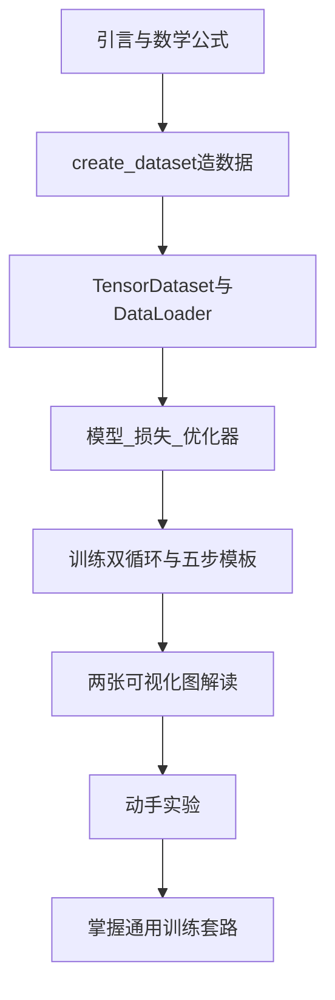

> 本文基于 sklearn 造数据 + PyTorch 训练 + matplotlib 可视化的完整示例，手把手讲清单特征线性回归的全流程。读完后你应能独立写出「前向 → 算损失 → 反向传播 → 更新参数」这套 PyTorch 固定套路。

---

## 要解决什么问题？

线性回归假设输入特征 `x` 和输出目标 `y` 之间存在 **线性关系**：


y = w * x + b

本示例使用 **1 个特征**（`n_features=1`），模型需要学习两个参数：

| 符号 | 含义 | 代码中的对应 |
|------|------|-------------|
| \( w \) | 权重（斜率） | `model.weight` |
| \( b \) | 偏置（截距） | `model.bias` |
| \( y \) | 模型预测值 | `y_pred` |

---

## 整体流程概览


程序入口只有两行：

```python
if __name__ == "__main__":
    x, y, coef = create_dataset()
    train_model(x, y, coef)
```

---

## 依赖导入

```python
from sklearn.datasets import make_regression
import torch
from torch.utils.data import TensorDataset, DataLoader
from torch import nn, optim
import matplotlib.pyplot as plt

plt.rcParams['font.sans-serif'] = ['SimHei']   # 中文显示
plt.rcParams['axes.unicode_minus'] = False      # 负号正常显示
```

| 模块 | 作用 |
|------|------|
| `make_regression` | 模拟线性回归数据集（学习阶段用，因为知道标准答案） |
| `torch` | PyTorch 核心库 |
| `TensorDataset` / `DataLoader` | 把张量包装成可分批迭代的数据集 |
| `nn` | 神经网络模块（`Linear`、`MSELoss`） |
| `optim` | 优化器（`SGD` 随机梯度下降） |
| `matplotlib` | 绘制损失曲线和拟合对比图 |

---

## `create_dataset()`：造数据，并保留标准答案

### 为什么用 `make_regression`？

真实项目中数据来自文件或数据库；学习阶段需要 **已知真实权重** 的数据，才能验证模型是否学对。`make_regression` 就像「老师出题」——它先定好 `coef` 和 `bias`，再按公式生成 `x`、`y`，因此训练后可以拿学到的 `w、b` 与真实值对比。

### 参数说明

```python
def create_dataset():
    x, y, coef = make_regression(
        n_samples=100,   # 100 条样本
        n_features=1,    # 1 个特征 → x 形状 (100, 1)
        bias=3.20,       # 真实截距 b = 3.2
        coef=True,       # 返回真实斜率 coef
        noise=10,        # 给 y 加噪声，数据不会完全落在直线上
        shuffle=True,    # 打乱样本顺序
        random_state=4   # 固定随机种子，每次运行数据一致
    )
    x = torch.tensor(x, dtype=torch.float32)
    y = torch.tensor(y, dtype=torch.float32)
    return x, y, coef
```

| 参数 | 说明 |
|------|------|
| `n_samples=100` | 100 条训练样本 |
| `n_features=1` | 每条样本 1 个特征，`x` 形状为 `(100, 1)` |
| `bias=3.20` | 数据生成时的真实截距 |
| `coef=True` | 返回真实权重数组 `coef`，形状 `(1,)` |
| `noise=10` | 噪声强度；损失不会降到 0 |
| `random_state=4` | 固定随机性，便于复现 |

真实关系为：

\[
y = x * coef[0] + 3.2 + n{噪声}
\]

> 说明：`coef` 是长度为 1 的数组，公式中写 `coef[0]` 更清晰；源码中 `tmp_x * coef` 在单特征下效果相同。

---

## DataLoader：为什么要分批加载？

### 两步包装

```python
dataset = TensorDataset(x, y)

dataloader = DataLoader(
    dataset,
    batch_size=16,   # 每批 16 条
    shuffle=True     # 每轮打乱顺序
)
```

**TensorDataset**：把 `x` 和 `y` 按行配对，第 `i` 条样本对应 `(x[i], y[i])`。

**DataLoader**：把 100 条数据切成多个 batch 逐批喂给模型。

### 本例的 batch 数量

100 条数据，`batch_size=16`：

- 6 个满 batch：6 × 16 = 96 条
- 1 个不满 batch：4 条
- **每轮 epoch 共 7 个 batch**

| 概念 | 含义 |
|------|------|
| **epoch（轮次）** | 把整个数据集完整过一遍 |
| **batch（批次）** | 每次取一小部分样本，更新一次参数 |
| `shuffle=True` | 每轮开始前打乱顺序，避免模型记住固定顺序 |

小数据集可以一次全喂，但 **分批训练** 是深度学习的标准做法，数据量大时尤其必要。

---

## 模型三件套

### 模型：`nn.Linear(1, 1)`

```python
model = nn.Linear(in_features=1, out_features=1, bias=True)
```

这就是 **全连接层 / 线性层**，数学上即：


y = w * x + b

| 属性 | 形状 | 含义 |
|------|------|------|
| `model.weight` | `(1, 1)` | 权重 \( w \) |
| `model.bias` | `(1,)` | 偏置 \( b \) |

初始时 `w`、`b` 为随机值，预测不准；训练过程就是不断调整它们。

### 损失函数：`nn.MSELoss()`

**均方误差（Mean Squared Error）**：


MSE = (1/n) * Σ(ŷ_i - y_i)²

预测越接近真实值，损失越小。线性回归 + MSE 是经典组合。

### 优化器：`optim.SGD`

```python
optimizer = optim.SGD(model.parameters(), lr=0.01)
```

**SGD（随机梯度下降）** 按如下规则更新参数：

w = w - lr * (∂loss / ∂w)

- `model.parameters()`：告诉优化器要更新哪些参数（`weight` 和 `bias`）
- `lr=0.01`：学习率，控制每步更新幅度；过大可能震荡，过小收敛慢

### 数学符号与代码对照

| 数学符号 | 代码 |
|----------|------|
| 特征 \( x \) | `x_train`，形状 `(batch, 1)` |
| 真实权重 | `coef[0]` |
| 真实偏置 | `3.2` |
| 预测 \( \hat{y} \) | `y_pred = model(x_train)` |
| 学到的权重 | `model.weight[0, 0]` |
| 学到的偏置 | `model.bias[0]` |
| 损失 | `loss_value = loss(y_pred, y_train)` |
| 梯度 | `loss_value.backward()` 自动计算 |
| 参数更新 | `optimizer.step()` |

---

## 训练循环（全文重点）

### 双层循环结构

```python
epochs = 100
loss_list = []

for epoch in range(epochs):              # 外层：100 轮
    total_loss_value = 0.0
    total_sample_cnt = 0

    for x_train, y_train in dataloader:  # 内层：每轮 7 个 batch
        # ... 训练步骤 ...

    # 每个 epoch 结束后记录一次平均损失
    avg_loss = total_loss_value / total_sample_cnt
    loss_list.append(avg_loss)
    print(f"第{epoch+1}轮次，损失值：{avg_loss}")
```

### 每个 batch 的五步模板（必背）

这是 PyTorch 训练的 **固定套路**，以后做 CNN、RNN 等模型，核心结构不变：

```python
# 1. 前向传播：用当前 w、b 计算预测值
y_pred = model(x_train)

# 2. 计算损失
loss_value = loss(y_pred, y_train.reshape(-1, 1))

# 3. 清空上一步的梯度（PyTorch 默认会累加梯度）
optimizer.zero_grad()

# 4. 反向传播：自动求导，计算 loss 对 w、b 的梯度
loss_value.backward()

# 5. 更新参数
optimizer.step()
```

### 几个细节

**`y_train.reshape(-1, 1)`**

- `y_train` 来自 DataLoader，形状 `(16,)` 或 `(4,)`
- `y_pred` 形状 `(batch, 1)`
- reshape 成 `(batch, 1)` 才能与 `y_pred` 对齐计算 MSE

**epoch 平均损失的计算**

```python
total_loss_value += loss_value.item() * len(y_train)
total_sample_cnt += len(y_train)
# epoch 结束后：
avg_loss = total_loss_value / total_sample_cnt
```

`loss_value` 是当前 batch 的 **平均** MSE；乘以样本数得到该 batch 的总平方误差，再除以总样本数，得到整个 epoch 的平均 MSE。

### 写代码时要注意的坑

**损失记录和绘图必须在内层 batch 循环之外。**

错误写法：在每个 batch 里 `loss_list.append(...)` 并 `plt.plot(range(100), loss_list)`，会导致：

- 第 1 轮只有 7 个 batch，`loss_list` 长度是 7，却用 `range(100)` 作横轴
- 报错：`ValueError: x and y must have same first dimension, but have shapes (100,) and (7,)`

正确结构：

```python
for epoch in range(epochs):
    for x_train, y_train in dataloader:
        # 只做训练，不 append、不 plot
        ...
    loss_list.append(avg_loss)   # 每个 epoch 结束后记录一次

# 全部训练结束后再画图
plt.plot(range(1, epochs + 1), loss_list)
plt.show()
```

---

## 可视化解读

训练结束后画两张图，均在 **全部 epoch 完成之后** 执行。

### 图 1：损失曲线

```python
plt.plot(range(1, epochs + 1), loss_list, label='损失值')
plt.xlabel('轮次')
plt.ylabel('损失值')
plt.title('循环轮次与损失值的关系')
plt.legend()
plt.grid()
plt.show()
```

| 观察点 | 正常表现 |
|--------|----------|
| 整体趋势 | 曲线下降，说明模型在学习 |
| 后期 | 趋于平稳（本例约稳定在 100 附近） |
| 能否到 0 | 不能，因为 `noise=10` 引入了不可消除的随机误差 |

### 图 2：散点 + 真实/预测直线对比

单特征场景下，这张图非常直观：横轴是 `x`，纵轴是 `y`。

```python
plt.scatter(x[:, 0], y)

axis_x = torch.linspace(x[:, 0].min(), x[:, 0].max(), 1000)

# 真实直线：y = x * coef[0] + 3.2
true_fn_torch = torch.tensor([tmp_x * coef[0] + 3.2 for tmp_x in axis_x])

# 预测直线：y = x * w + b
pred_fn_torch = torch.tensor([
    tmp_x * model.weight[0, 0].detach() + model.bias[0].detach()
    for tmp_x in axis_x
])

plt.plot(axis_x, true_fn_torch, label='真实线性回归曲线', c='r')
plt.plot(axis_x, pred_fn_torch, label='预测线性回归曲线', c='b')
plt.legend()
plt.grid()
plt.title('预测和真实结果对比')
plt.show()
```

| 元素 | 含义 |
|------|------|
| 散点 | 100 条样本，因噪声而分散在直线附近 |
| 红线 | 生成数据时用的真实关系 |
| 蓝线 | 模型学到的关系 |
| `.detach()` | 从计算图分离，只取值用于画图，不参与梯度 |

**训练成功后，红线和蓝线几乎重合是正常现象。** 说明模型已较好学到真实斜率和截距。散点本身较散，是因为 `noise=10`；线代表的是趋势，不是每个点都落在线上。

---

## 动手实验建议

改参数后重新运行，观察变化，理解会更深：

| 改动 | 预期现象 |
|------|----------|
| `epochs = 10` | 训练不充分，损失仍较高，红蓝线可能明显分开 |
| `lr = 0.5`（过大） | 损失震荡甚至发散 |
| `lr = 0.0001`（过小） | 100 轮后仍未充分收敛 |
| `noise = 0` | 散点更贴近直线，损失可降得更低 |
| `batch_size = 100` | 每轮只有 1 个 batch，仍可训练，随机性变小 |
| 打印参数对比 | `print(coef[0], model.weight[0,0].item(), 3.2, model.bias[0].item())` 看学到的值是否接近真实值 |

---

## 小结

本文走完了 PyTorch 线性回归的完整链路：



**PyTorch 训练通用套路**（与具体模型无关）：

```python
for epoch in range(epochs):
    for x_batch, y_batch in dataloader:
        y_pred = model(x_batch)           # 前向
        loss_value = loss_fn(y_pred, y_batch)  # 算损失
        optimizer.zero_grad()             # 清梯度
        loss_value.backward()             # 反向传播
        optimizer.step()                  # 更新参数
```

区别通常只是：模型从 `nn.Linear` 换成更复杂的网络，损失函数和优化器换成其他变体，但 **这五步结构始终不变**。
