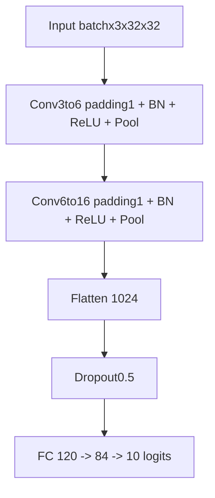
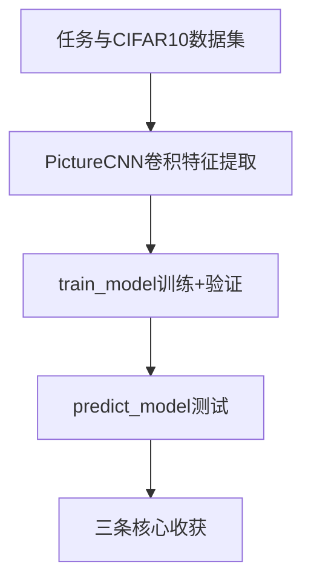

> 本文基于 CIFAR-10 数据集 + PyTorch 卷积神经网络，完整走通「加载图片 → 搭建 CNN → 训练验证 → 测试评估」的图像分类 pipeline。当前版本测试准确率约 **69.6%**。读完后你应能理解：CNN 如何处理二维图像、卷积/池化/全连接各自干什么，以及验证集与 checkpoint 保存策略为何重要。

---

## 要解决什么问题？

给定一张 **32×32 像素的 RGB 彩色图**，判断它属于下面 10 个类别中的哪一个：

| 索引 | 类别 | 英文 |
|------|------|------|
| 0 | 飞机 | airplane |
| 1 | 汽车 | automobile |
| 2 | 鸟 | bird |
| 3 | 猫 | cat |
| 4 | 鹿 | deer |
| 5 | 狗 | dog |
| 6 | 青蛙 | frog |
| 7 | 马 | horse |
| 8 | 船 | ship |
| 9 | 卡车 | truck |

| 项目 | 说明 |
|------|------|
| 任务类型 | **多分类**（10 个类别） |
| 训练集 | 50000 张 |
| 测试集 | 10000 张 |
| 评估指标 | 分类准确率（Accuracy） |

与之前写的`[PyTorch 手机价格预测]`对比：

| 对比项 | 手机价格预测 | CIFAR-10 图像分类 |
|--------|-------------|------------------|
| 输入 | 20 维表格特征 | 3×32×32 图像张量 |
| 模型 | 全连接 MLP | 卷积 CNN |
| 特征提取 | 无（直接用原始特征） | 卷积层自动学局部纹理/边缘 |
| 预处理 | StandardScaler 标准化 | ToTensor（像素缩放到 [0,1]） |
| 数据规模 | ~2000 条 | 60000 张 |

---

## 整体流程概览


程序入口：

```python
def main():
    train_dataset, test_dataset = create_dataset()
    val_size = int(len(train_dataset) * 0.05)
    train_size = len(train_dataset) - val_size
    train_dataset, val_dataset = random_split(
        train_dataset, [train_size, val_size],
        generator=torch.Generator().manual_seed(42)
    )
    train_model(train_dataset, val_dataset)
    predict_model(test_dataset)
```

---

## 依赖导入

```python
import torch
import torch.nn as nn
from torchvision.datasets import CIFAR10
from torchvision.transforms import ToTensor
import torch.optim as optim
from torch.utils.data import DataLoader
from torch.utils.data import random_split
from tqdm import tqdm

device = torch.device('cuda' if torch.cuda.is_available() else 'cpu')
```

| 模块 | 作用 |
|------|------|
| `CIFAR10` | torchvision 内置数据集，自动读取 `cifar-10-batches-py` |
| `ToTensor` | PIL 图片 → 张量，像素 [0,255] → [0,1] |
| `DataLoader` | 按 batch 加载，支持 shuffle |
| `random_split` | 从训练集切出验证集 |
| `device` | 自动选择 GPU 或 CPU |

---

## `create_dataset()`：数据加载

### CIFAR10 参数

```python
train_dataset = CIFAR10(
    root='./day21_卷积神经网络CNN/data',
    train=True,
    transform=ToTensor(),
    download=False
)
test_dataset = CIFAR10(
    root='./day21_卷积神经网络CNN/data',
    train=False,
    transform=ToTensor(),
    download=False
)
```

| 参数 | 说明 |
|------|------|
| `root` | 数据集**父目录**，torchvision 会在其下找 `cifar-10-batches-py` |
| `train=True/False` | True 加载 50000 训练图，False 加载 10000 测试图 |
| `transform=ToTensor()` | 输出形状 `[3, 32, 32]`，值域 [0, 1] |
| `download=False` | 本地无数据时可改 True 自动下载 |

**踩坑预告**：`root` 不要写成 `.../data/cifar-10-batches-py`，否则会报 `Dataset not found`（详见第十二节）。

### 验证集划分

从 50000 训练样本中切 **5%（2500 张）** 作验证集，剩余 47500 张用于训练：

```python
val_size = int(len(train_dataset) * 0.05)
train_size = len(train_dataset) - val_size
train_dataset, val_dataset = random_split(
    train_dataset, [train_size, val_size],
    generator=torch.Generator().manual_seed(42)
)
```

验证集**不参与**参数更新，只用来监控泛化、选择最优 checkpoint。

---

## `PictureCNN`：模型结构（核心）

### 网络总览

LeNet 风格：两层卷积 + 两层池化 + 三层全连接，并加入 BatchNorm 和 Dropout。



| 阶段 | 层 | 输出形状 |
|------|-----|---------|
| 输入 | — | [batch, 3, 32, 32] |
| Conv1 + BN + ReLU + Pool | 3→6 通道, padding=1 | [batch, 6, 16, 16] |
| Conv2 + BN + ReLU + Pool | 6→16 通道, padding=1 | [batch, 16, 8, 8] |
| Flatten | reshape | [batch, 1024] |
| FC1 + ReLU | 1024→120 | [batch, 120] |
| FC2 + ReLU | 120→84 | [batch, 84] |
| FC3（输出） | 84→10 | [batch, 10] |

### 特征图尺寸怎么算？

卷积输出尺寸公式（单维）：

$$
\text{out} = \frac{\text{in} - \text{kernel} + 2 \times \text{padding}}{\text{stride}} + 1
$$
`padding=1`、3×3 卷积、stride=1 时，**空间尺寸不变**：

```
32  --Conv(padding=1)-->  32  --Pool(2x2)-->  16
16  --Conv(padding=1)-->  16  --Pool(2x2)-->   8
```

展平维度：`16 × 8 × 8 = 1024`，因此 `fc1` 的 `in_features=16*8*8`。

若用 `padding=0`（我最初的写法），尺寸会快速缩小到 6×6，且边缘信息丢失更快——后来改成 `padding=1` 是明显的结构改进。

### 卷积 + 池化定义

```python
self.conv1 = nn.Conv2d(3, 6, kernel_size=3, stride=1, padding=1)
self.bn1   = nn.BatchNorm2d(6)
self.pool1 = nn.MaxPool2d(kernel_size=2, stride=2)

self.conv2 = nn.Conv2d(6, 16, kernel_size=3, stride=1, padding=1)
self.bn2   = nn.BatchNorm2d(16)
self.pool2 = nn.MaxPool2d(kernel_size=2, stride=2)
```

| 组件 | 作用 |
|------|------|
| `Conv2d` | 用卷积核在图像上滑动，提取局部特征（边缘、纹理） |
| `BatchNorm2d` | 归一化每层激活，加速收敛、稳定训练 |
| `MaxPool2d` | 2×2 窗口取最大值，降维 + 增强平移鲁棒性 |

### 全连接 + Dropout

```python
self.dropout = nn.Dropout(p=0.5)
self.fc1 = nn.Linear(16*8*8, 120)
self.fc2 = nn.Linear(120, 84)
self.fc3 = nn.Linear(84, 10)
```

Dropout 在训练时随机丢弃 50% 神经元，减轻全连接层过拟合。推理时 `model.eval()` 会自动关闭 Dropout。

### 前向传播

```python
def forward(self, x):
    x = self.pool1(torch.relu(self.bn1(self.conv1(x))))
    x = self.pool2(torch.relu(self.bn2(self.conv2(x))))
    x = x.reshape(x.shape[0], -1)
    x = self.dropout(x)
    x = torch.relu(self.fc1(x))
    x = torch.relu(self.fc2(x))
    x = self.fc3(x)
    return x
```

输出 10 个 **logits**（未归一化分数）。配合 `CrossEntropyLoss` 时**不需要**手动 Softmax——损失函数内部已包含。

---

## `train_model()`：训练与验证

### 超参数

```python
dataloader = DataLoader(train_dataset, batch_size=200, shuffle=True)
val_dataloader = DataLoader(val_dataset, batch_size=200, shuffle=False)

model = PictureCNN().to(device)
loss_fn = nn.CrossEntropyLoss()
optimizer = optim.Adam(model.parameters(), lr=0.001, weight_decay=1e-4)

epochs = 30
best_val_acc = 0
```

| 参数 | 值 | 说明 |
|------|-----|------|
| optimizer | Adam | lr=0.001, weight_decay=1e-4 |
| epochs | 30 | 完整遍历训练集 30 次 |
| batch_size | 200 | 47500 / 200 ≈ 238 batch/epoch |
| val_ratio | 5% | 47500 训练 / 2500 验证 |
| 保存策略 | 验证 acc 最高 | 写入 `picture_cnn.pth` |

`weight_decay=1e-4` 是 L2 正则，惩罚过大权重，降低过拟合风险。

### 6.2 训练循环（五步模板）

与 [线性回归博客](PyTorch线性回归入门.md) 和手机价格预测完全一致，只是模型换成了 CNN：

```python
for epoch in range(epochs):
    for x_train, y_train in tqdm(dataloader):
        x_train, y_train = x_train.to(device), y_train.to(device)
        model.train()
        y_pred = model(x_train)
        loss_value = loss_fn(y_pred, y_train)

        optimizer.zero_grad()
        loss_value.backward()
        optimizer.step()

    val_loss, val_acc = evaluate_model(model, val_dataloader, loss_fn)
    if val_acc > best_val_acc:
        best_val_acc = val_acc
        torch.save(model.state_dict(), 'picture_cnn.pth')
```

每轮训练结束后在验证集上评估，**只有验证准确率创新高时才保存权重**——避免把过拟合的最后一轮当作最终模型。

### `evaluate_model()` 要点

```python
model.eval()
with torch.no_grad():
    for x_val, y_val in dataloader:
        x_val, y_val = x_val.to(device), y_val.to(device)
        y_pred = model(x_val)
        correct += (y_pred.argmax(dim=1) == y_val).sum().item()
```

| 步骤 | 作用 |
|------|------|
| `model.eval()` | 关闭 Dropout，BatchNorm 用全局统计量 |
| `torch.no_grad()` | 不算梯度，省显存、加速 |
| `argmax(dim=1)` | 10 个 logits 中取最大值索引 → 预测类别 |

### 终端输出解读

```
训练第21轮，训练损失：0.8842，验证损失：0.8869，验证准确率：0.6892
...
测试集准确率：0.6959
```

| 指标 | 含义 |
|------|------|
| 训练损失 | 当前 epoch 在训练集上的平均交叉熵 |
| 验证损失 | 在 2500 张验证图上的平均交叉熵 |
| 验证准确率 | 验证集预测正确比例，用于选 checkpoint |
| 测试准确率 | 10000 张官方测试集上的最终泛化指标 |

RTX 4060 上每轮约 **3~4 秒**（238 个 batch）。

---

## `predict_model()`：测试评估

```python
model = PictureCNN().to(device)
model.load_state_dict(torch.load('picture_cnn.pth', map_location=device))
model.eval()

for x_test, y_test in dataloader:
    x_test, y_test = x_test.to(device), y_test.to(device)
    y_pred = model(x_test)
    correct_count += (y_pred.argmax(dim=1) == y_test).sum().item()

print(f'测试集准确率：{correct_count/len(test_dataset)}')
```

测试集在训练全程**从未参与**参数更新或 checkpoint 选择，因此 ~69.6% 反映的是真实泛化能力。

---

## device 使用规范

| 位置 | 做法 |
|------|------|
| 全局 | `device = torch.device('cuda' if torch.cuda.is_available() else 'cpu')` |
| 模型 | `model = PictureCNN().to(device)` |
| 每个 batch | `x_train.to(device), y_train.to(device)` |
| 加载权重 | `torch.load(..., map_location=device)` |

常见错误：`torchsummary` 默认把输入放 GPU，模型若在 CPU 会报 `Input type (cuda) and weight type (cpu) should be the same`——需让模型与 summary 的 `device` 参数一致。

---

## 运行方式

```bash
cd C:\Python_Project\Advanced_LLM_Development
python day21_卷积神经网络CNN/04_图像分类案例.py
```

依赖：`torch`、`torchvision`、`tqdm`（可选 `torchsummary` 查看结构）。

首次运行若数据缺失，将 `download=False` 改为 `True` 即可自动下载 CIFAR-10。

---

## 实验记录与踩坑

这一章记录我实际跑出来的结果和翻过的坑——比「教程正文」更有价值。

### 各阶段准确率对比

| 阶段 | 主要配置 | 测试准确率 |
|------|----------|-----------|
| 原始 LeNet | ToTensor，2 层卷积，无 BN/Dropout | ~60% |
| +增强+BN+Dropout | RandomCrop/Flip/Normalize | ~68.6% |
| +Step3 完整 | 10% 验证集 + StepLR + 保存最优 | ~63.5%（**下降**） |
| 当前版本 | ToTensor，5% 验证集，StepLR 已注释 | **~69.6%** |

准确率不是「优化越多越好」，错误组合反而会变差。

### 踩坑 1：CIFAR10 的 root 路径

**现象**：`RuntimeError: Dataset not found or corrupted`

**原因**：`root` 写成了 `.../data/cifar-10-batches-py`，torchvision 会再拼一层 `cifar-10-batches-py`，路径多嵌套。

**正确写法**：`root='./day21_卷积神经网络CNN/data'`

### 踩坑 2：torchsummary 设备不一致

**现象**：`Input type (cuda) and weight type (cpu) should be the same`

**原因**：`summary()` 默认 `device="cuda"`，模型未 `.to(device)`。

**教训**：调用 summary 前模型和数据必须在同一设备。

### 踩坑 3：Adam ≠ 不需要 scheduler

Adam 为**每个参数**自适应步长，解决的是「不同参数更新幅度该不该一样」。

StepLR 改的是**全局基础 lr** 随 epoch 的时间表，解决的是「后期要不要整体减速」。

两者不重复。但对本案例 30 轮小 CNN，`StepLR(step_size=10, gamma=0.1)` **过于激进**——第 11 轮 lr 直接 ×0.1，末轮训练 loss ~1.19，远高于不加 scheduler 时的 ~1.07。当前代码已注释 scheduler。

### 踩坑 4：验证集切走训练数据

10% 验证集 → 只剩 45000 训练样本，直接损失约 2~4% 准确率。改成 5%（47500 训练）是折中。

### 踩坑 5：验证集继承了随机增强

若训练集 transform 含 `RandomCrop`/`RandomHorizontalFlip`，`random_split` 切出的验证集**也会随机增强**——验证指标噪声大、checkpoint 可能选错。

正确做法：验证集应使用与测试集相同的 transform（仅 ToTensor + Normalize，无随机操作）。当前版本已改回 `ToTensor()`，此问题不再触发。

### 踩坑 6：保存最优 vs 保存最后一轮

Step3 按验证 acc 保存，峰值出现在 epoch 21（~61% val acc），而非 epoch 30。若验证指标不可靠或模型尚未训满，测试 acc 会低于「保存最后一轮」的基线。

---

## 下一步可以做什么

| 方向 | 预期收益 |
|------|----------|
| 恢复数据增强 + Normalize（验证集单独 transform） | +5~10% |
| 换 ResNet-18 | ~93%+ |
| DataLoader 加 `num_workers` + `pin_memory` | 提速 |
| AMP 混合精度 | GPU 上约 1.5~2× 加速 |
| 混淆矩阵 / 各类 F1 | 分析哪些类别容易混淆（猫 vs 狗） |

---

## 小结



**三条核心收获**：

1. **CNN 的核心是「卷积提特征 + 全连接做分类」** — 卷积/池化负责从像素中找模式，FC 负责把特征映射到 10 个类别。
2. **图像任务要算清特征图尺寸** — `padding`、`pool` 改变展平维度，算错 `in_features` 会直接报错。
3. **调参要看验证曲线，不能盲目堆技巧** — 验证集、scheduler、数据增强、保存策略要配套设计，否则准确率反而下降。
