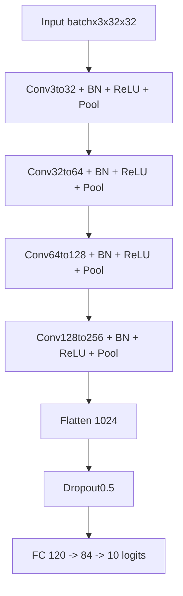
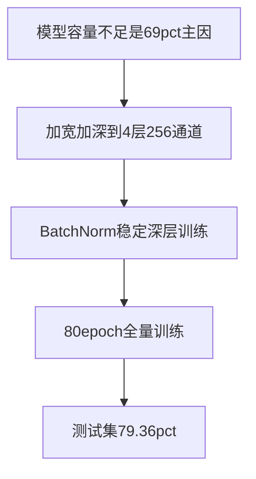

> 本文是 [PyTorch CIFAR-10 图像分类：从零搭建 CNN 实战](PyTorch_CIFAR10图像分类_CNN实战.md) 的进阶补充。前一篇解决了「CNN pipeline 跑通 + 验证集/checkpoint 方法论」，测试准确率约 **69.6%**。本篇在**不改数据增强、不改预处理（仍 ToTensor）**的前提下，通过**加宽加深网络 + 启用 BatchNorm + 延长训练**，将测试准确率提升到 **79.36%**。

前序阅读：[PyTorch CIFAR-10 图像分类：从零搭建 CNN 实战](PyTorch_CIFAR10图像分类_CNN实战.md)

---

## 为什么需要第二篇？

第一篇跑通后，我发现一个关键事实：**69% 的瓶颈主要不在卷积核尺寸，而在模型容量不够。**

LeNet 风格的 2 层 CNN（3→6→16 通道）是为 MNIST 量级的简单任务设计的。CIFAR-10 是 32×32 彩色图、10 个细粒度类别（猫 vs 狗、鸟 vs 飞机），需要更深的层次来组合「边缘 → 纹理 → 语义」，也需要更多的通道来存储这些特征。

本篇的优化路径：


---

## 改动总览

| 对比项 | 第一篇（~69.6%） | 本篇（~79.4%） |
|--------|------------------|----------------|
| 卷积层数 | 2 | 4 |
| 通道 | 3→6→16 | 3→32→64→128→256 |
| BatchNorm | 有定义/曾启用 | 4 层全部启用 |
| 展平维度 | 16×8×8=1024 | 256×2×2=1024 |
| 验证集 | 5% val + 最优 checkpoint | 全量 50000 训练，保存最后一轮 |
| batch_size | 200 | 100 |
| epochs | 30 | 80 |
| 预处理 | ToTensor | ToTensor（未变） |
| kernel / pool | 3×3, padding=1, Pool 2×2 | **相同，未改** |

**核心结论**：卷积核、步长、池化窗口这些「形状参数」第一篇已经合理；真正带来 ~10 个百分点提升的是**网络更深、更宽，以及 BN 让深层网络训得动**。

---

## 模型结构升级

### 新架构总览

4 个卷积块，每块 **Conv → BN → ReLU → MaxPool**：



| 阶段 | 层 | 输出形状 |
|------|-----|---------|
| 输入 | — | [batch, 3, 32, 32] |
| Block1 | Conv 3→32 + BN + ReLU + Pool | [batch, 32, 16, 16] |
| Block2 | Conv 32→64 + BN + ReLU + Pool | [batch, 64, 8, 8] |
| Block3 | Conv 64→128 + BN + ReLU + Pool | [batch, 128, 4, 4] |
| Block4 | Conv 128→256 + BN + ReLU + Pool | [batch, 256, 2, 2] |
| Flatten | reshape | [batch, 1024] |
| FC1 + ReLU | 1024→120 | [batch, 120] |
| FC2 + ReLU | 120→84 | [batch, 84] |
| FC3（输出） | 84→10 | [batch, 10] |

### 特征图尺寸推导

`padding=1`、3×3 卷积、stride=1 时，**卷积不改变空间尺寸**；每次 MaxPool(2×2, stride=2) 高宽减半：

```
32  --Conv(padding=1)-->  32  --Pool-->  16
16  --Conv(padding=1)-->  16  --Pool-->   8
 8  --Conv(padding=1)-->   8  --Pool-->   4
 4  --Conv(padding=1)-->   4  --Pool-->   2
```

4 次池化后 spatial = 2×2，通道 = 256，展平维度：

```
256 × 2 × 2 = 1024
```

因此 `fc1` 的 `in_features=256*2*2`。

**踩坑提醒**：第一篇是 2 次池化 → 8×8，本篇是 4 次池化 → 2×2。加深网络时**必须重算展平维度**，否则 `Linear` 层会报 size mismatch。

### 为何加宽通道？

| 通道设置 | 设计背景 | CIFAR-10 适配 |
|----------|----------|---------------|
| 6 / 16（LeNet） | 28×28 灰度 MNIST | 容量不足，10 类彩色图学不动 |
| 32 / 64 / 128 / 256 | 现代小型 CNN 常用宽度 | 每层能存更多特征图，表达能力显著提升 |

可以把通道理解为「这一层要提取多少种不同的特征模式」。通道太少，猫耳、车轮、机翼等模式会挤在同一组特征里，分类边界模糊。

### 为何加深到 4 层？

| 层次 | 可能学到的模式 |
|------|---------------|
| 浅层（conv1~2） | 边缘、颜色块、简单纹理 |
| 深层（conv3~4） | 组合纹理 → 局部部件（眼睛、翅膀、车窗） |

2 层卷积只能做「边缘 + 简单纹理」，对「猫 vs 狗」这类细粒度区分不够；4 层提供了更深的非线性组合空间。

### 关键代码

卷积块定义：

```python
self.conv1 = nn.Conv2d(in_channels=3, out_channels=32, kernel_size=3, stride=1, padding=1)
self.bn1 = nn.BatchNorm2d(32)
self.pool1 = nn.MaxPool2d(kernel_size=2, stride=2)

self.conv2 = nn.Conv2d(in_channels=32, out_channels=64, kernel_size=3, stride=1, padding=1)
self.bn2 = nn.BatchNorm2d(64)
self.pool2 = nn.MaxPool2d(kernel_size=2, stride=2)

self.conv3 = nn.Conv2d(in_channels=64, out_channels=128, kernel_size=3, stride=1, padding=1)
self.bn3 = nn.BatchNorm2d(128)
self.pool3 = nn.MaxPool2d(kernel_size=2, stride=2)

self.conv4 = nn.Conv2d(in_channels=128, out_channels=256, kernel_size=3, stride=1, padding=1)
self.bn4 = nn.BatchNorm2d(256)
self.pool4 = nn.MaxPool2d(kernel_size=2, stride=2)
```

前向传播（标准顺序 Conv → BN → ReLU → Pool）：

```python
def forward(self, x):
    x = self.pool1(torch.relu(self.bn1(self.conv1(x))))
    x = self.pool2(torch.relu(self.bn2(self.conv2(x))))
    x = self.pool3(torch.relu(self.bn3(self.conv3(x))))
    x = self.pool4(torch.relu(self.bn4(self.conv4(x))))
    x = x.reshape(x.shape[0], -1)
    x = self.dropout(x)
    x = torch.relu(self.fc1(x))
    x = torch.relu(self.fc2(x))
    x = self.fc3(x)
    return x
```

全连接部分与第一篇相同（120 → 84 → 10），Dropout(p=0.5) 保留。

---

## BatchNorm 专题

第一篇在表格里提过 BN，但没有展开。本篇 4 层卷积全部启用 BN，它是深层网络能稳定训练的关键组件。

### BN 做什么？

对每个通道，在 **batch × 高 × 宽** 的所有数值上计算均值 μ 和方差 σ²，做标准化：

$$
\hat{x} = \frac{x - \mu}{\sqrt{\sigma^2 + \epsilon}}
$$
再用两个**可学习参数**微调：

$$y = \gamma \cdot \hat{x} + \beta$$

| PyTorch 属性 | 数学符号 | 是否训练 | 作用 |
|--------------|----------|----------|------|
| `weight` | γ（gamma） | ✅ | 缩放 |
| `bias` | β（beta） | ✅ | 平移 |
| `running_mean` | 全局 μ | ❌（累计） | 推理时用 |
| `running_var` | 全局 σ² | ❌（累计） | 推理时用 |

`BatchNorm2d(32)` 表示对 32 个通道**分别**归一化，每个通道一对 γ/β，共 64 个可训练参数。

### 为什么需要 γ 和 β？

纯标准化会把分布固定到均值 0、方差 1，可能限制网络表达。γ 和 β 让网络自己决定「标准化后要不要拉回去」——初始时 γ=1、β=0，等价于纯标准化；训练中自动调整。

### 标准放置顺序

```text
Conv → BN → ReLU → Pool
```

BN 放在 ReLU 之前（最常见做法），在卷积输出进入激活函数前先把数值分布 stabilize。

### 训练 vs 推理

| 阶段 | 调用 | BN 行为 |
|------|------|---------|
| 训练 | `model.train()` | 用**当前 batch** 的 μ、σ²；同时更新 running 统计 |
| 推理 | `model.eval()` | 用训练累计的 **running_mean / running_var** |

测试时必须 `model.eval()`，否则 BN 和 Dropout 会按训练模式工作，准确率不准。

### BN 与 Dropout 的分工

| 组件 | 位置 | 目的 |
|------|------|------|
| BatchNorm | 卷积块内 | 稳定各层输入分布，加速收敛 |
| Dropout | 全连接前 | 随机丢弃神经元，减轻 FC 过拟合 |

两者不冲突：BN 让卷积部分训得稳，Dropout 让分类头别记死训练集。

---

## 训练策略变化

### 超参数对比

```python
dataloader = DataLoader(train_dataset, batch_size=100, shuffle=True)
optimizer = optim.Adam(model.parameters(), lr=0.001, weight_decay=1e-4)
epochs = 80
```

| 参数 | 第一篇 | 本篇 | 说明 |
|------|--------|------|------|
| batch_size | 200 | 100 | 更小 batch 带来略大的梯度噪声 |
| epochs | 30 | 80 | 更深网络需要更多轮次收敛 |
| lr | 0.001 | 0.001 | 不变 |
| weight_decay | 1e-4 | 1e-4 | L2 正则保留 |
| StepLR | 已注释 | 仍注释 | 第一篇踩坑：激进 scheduler 反而降 acc |

### 为何训练 80 轮？

4 层 × 256 通道的参数量远大于 LeNet。30 轮时深层权重尚未充分更新；延长到 80 轮后，训练损失从第一篇末轮的 ~0.88 降到 ~0.08，模型才「吃透」了训练集的特征。

### 验证集策略的变化

第一篇从 50000 中切 5% 验证集，按**验证准确率最高**保存 checkpoint——方法论正确。

本篇为了最大化训练数据、简化流程，改为：

- **全量 50000 张训练**
- **保存最后一轮权重**

这是一个有意识的取舍：多 2500 张训练样本对 small CNN 有约 1~2% 的潜在收益，但失去了「自动选最优 epoch」的能力。若末轮出现过拟合，测试 acc 可能低于训练中某个中间 epoch——下文实验记录会客观反映这一点。

---

## 实验记录

### 准确率对比

| 版本 | 测试准确率 | 主要配置 |
|------|-----------|----------|
| 第一篇 LeNet | **69.59%** | 2 层，6/16 通道，30 epoch，5% 验证集 |
| 本篇 PictureCNN | **79.36%** | 4 层，32~256 通道，BN，80 epoch，全量训练 |

提升约 **+9.8 个百分点**，未引入任何数据增强。

### 终端输出（本篇最终轮）

```
训练第80轮，训练损失：0.0790，耗时：4.97秒
训练完成，最后一轮模型已保存至 picture_cnn.pth
测试集准确率：0.7936
```

RTX 4060 上每轮约 **5 秒**（500 batch/epoch，batch_size=100）。

### 过拟合观察

| 指标 | 数值 | 解读 |
|------|------|------|
| 末轮训练损失 | ~0.08 | 训练集拟合充分 |
| 测试准确率 | ~79.4% | 与训练 loss 之间存在差距 |

训练 loss 已经很低，但测试 acc 未到 90%+，说明模型对训练集仍有一定程度的「记忆」。这在未做数据增强的小 CNN 上是正常现象——**容量加上去了，泛化手段还没跟上**。

---

## 小结



**三条核心收获**：

1. **CIFAR-10 上，加宽加深 + BN 比微调 kernel/stride 收益更大** — 第一篇的 3×3 卷积、padding=1、Pool 2×2 无需改动，瓶颈在 6/16 通道太窄、层数太浅。
2. **展平维度要随池化次数重算** — 4 次 Pool 后 spatial=2×2（不是 8×8），`fc1.in_features=256*2*2=1024`。
3. **BN 是深层 CNN 的稳定器** — 4 层网络若无 BN，训练容易发散或收敛极慢；启用 BN 后配合更长训练，才发挥加宽加深的容量优势。
