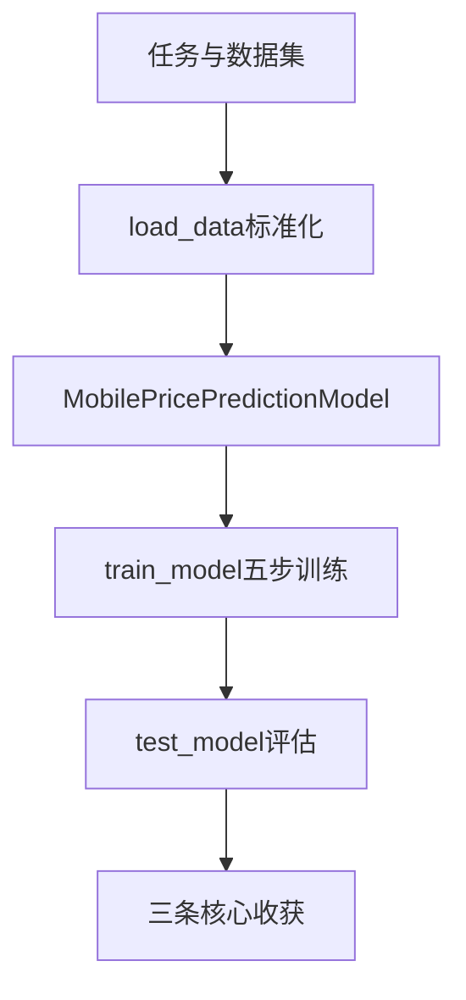

> 本文基于真实 CSV 数据集 + PyTorch 全连接神经网络，完整走通「读数据 → 标准化 → 训练 → 测试」的多分类 pipeline。最终测试准确率约 **92.5%**。读完后你应能理解：tabular 数据上预处理有多重要，以及 PyTorch 分类任务与回归任务共享同一套训练套路。

---

## 要解决什么问题？

给定一部手机的 **20 维硬件/功能特征**（电池容量、RAM、像素、是否支持 4G 等），预测它属于哪个 **价格档次**。

| 项目 | 说明 |
|------|------|
| 任务类型 | **多分类**（4 个类别） |
| 标签 `price_range` | 0 / 1 / 2 / 3，代表由低到高的 4 个价格区间 |
| 数据规模 | 约 2000 条样本，21 列（20 特征 + 1 标签） |
| 评估指标 | 分类准确率（Accuracy） |

与之前写的 PyTorch 线性回归入门 对比：

| 对比项 | 线性回归 | 手机价格预测 |
|--------|---------|-------------|
| 输出 | 连续数值（房价、温度） | 离散类别（0~3） |
| 损失函数 | `MSELoss` | `CrossEntropyLoss` |
| 预测方式 | 直接输出数值 | `argmax` 取得分最高的类别 |
| 模型 | 单层 `Linear` | 多层 MLP（全连接网络） |

---

## 数据集与特征

数据文件：`手机价格预测.csv`，部分特征及典型量纲如下：

| 特征 | 含义 | 典型范围 |
|------|------|---------|
| `battery_power` | 电池容量 | 500 ~ 2000 |
| `ram` | 内存 | 500 ~ 4000 |
| `clock_speed` | 处理器主频 | 0.5 ~ 3 |
| `px_height` / `px_width` | 像素高/宽 | 0 ~ 2000 |
| `blue` / `wifi` / `four_g` | 布尔型功能 | 0 或 1 |

**我一开始忽略的一点**：这些特征量纲差异极大。`ram` 动辄两三千，而 `clock_speed` 只有个位数。如果不做标准化，大数值特征会主导梯度，模型很难学好——这是我后面踩坑的核心原因（见第四节复盘）。

---

## 整体流程概览


程序入口只有三行：

```python
if __name__ == '__main__':
    x_train, x_test, y_train, y_test = load_data()
    train_model(x_train, y_train)
    test_model(x_test, y_test)
```

---

## 依赖导入

```python
import pandas as pd
from sklearn.model_selection import train_test_split
from sklearn.preprocessing import StandardScaler
import torch
import tqdm
import matplotlib.pyplot as plt
```

| 模块 | 作用 |
|------|------|
| `pandas` | 读取 CSV 表格 |
| `train_test_split` | 划分训练集 / 测试集 |
| `StandardScaler` | Z-score 特征标准化 |
| `torch` | 神经网络建模与训练 |
| `tqdm` | 训练进度条 |
| `matplotlib` | 绘制损失曲线 |

---

## `load_data()`：数据加载与预处理

### 读 CSV & 特征/标签分离

```python
df = pd.read_csv('./day20_神经网络基础/手机价格预测/手机价格预测.csv', encoding='utf-8')
x = df.drop(columns=['price_range'])   # 20 维特征
y = df['price_range']                  # 标签：0/1/2/3
```

`price_range` 是我们要预测的目标，必须从特征中剔除，否则模型会「偷看答案」。

### 训练测试划分

```python
x_train, x_test, y_train, y_test = train_test_split(
    x, y, test_size=0.2, random_state=304, shuffle=True, stratify=y
)
```

| 参数 | 说明 |
|------|------|
| `test_size=0.2` | 80% 训练（约 1600 条），20% 测试（约 400 条） |
| `random_state=304` | 固定随机种子，每次划分结果一致 |
| `shuffle=True` | 划分前打乱，避免原始顺序偏差 |
| `stratify=y` | 分层抽样，保证 train/test 中各类别比例一致 |

### StandardScaler 标准化（本章最重要）

```python
scaler = StandardScaler()
x_train = scaler.fit_transform(x_train)   # 只在训练集 fit
x_test = scaler.transform(x_test)           # 测试集只用 transform
```

标准化公式（Z-score）：

$$x' = \frac{x - \mu}{\sigma}$$

其中 \($$\mu$$\) 和 \($$\sigma$$\) 由**训练集**计算，测试集沿用同一套参数，避免数据泄漏。

**我的优化复盘**：

| 阶段 | 配置 | 测试准确率 |
|------|------|-----------|
| 初版 | 无标准化 + 较深网络 + SGD | ~62% |
| 优化后 | StandardScaler + 3 层小 MLP + Adam | **~92.5%** |

准确率从 62% 跳到 92%，主要功劳是标准化，而不是把网络堆得更深。tabular 数据上，**预处理往往比堆模型更有效**——这是我这次最大的收获。

### 转为 Tensor 并指定 device

```python
device = torch.device('cuda' if torch.cuda.is_available() else 'cpu')

x_train = torch.tensor(x_train, dtype=torch.float32, device=device)
x_test = torch.tensor(x_test, dtype=torch.float32, device=device)
y_train = torch.tensor(y_train.values, dtype=torch.long, device=device)
y_test = torch.tensor(y_test.values, dtype=torch.long, device=device)
```

| Tensor | dtype | 原因 |
|--------|-------|------|
| 特征 `x` | `float32` | 神经网络权重和激活值为浮点 |
| 标签 `y` | `long`（int64） | `CrossEntropyLoss` 要求类别索引为整数 |

数据在 `load_data` 中一次性放到 GPU/CPU，后续 DataLoader 取出的 batch 自动在同一设备上。

---

## `MobilePricePredictionModel`：模型设计

### 网络结构

```
输入 20 → Linear 64 → ReLU → Linear 128 → ReLU → Linear 64 → ReLU → Linear 4
```

| 层 | 输入维度 | 输出维度 | 激活 |
|----|---------|---------|------|
| linear1 | 20 | 64 | ReLU |
| linear2 | 64 | 128 | ReLU |
| linear3 | 128 | 64 | ReLU |
| output | 64 | 4 | 无 |

输出 4 个值对应 4 个类别的 **logits**（未归一化得分），取得分最高者即为预测类别。

### 为什么选「小网络」？

数据集只有约 2000 条。我试过 5 层、512 维的深层网络，训练损失能降得很低，但测试准确率反而不如这个 3 层 64~128 维的结构——典型的**过拟合**。小样本 tabular 任务，适度容量的 MLP 往往更合适。

### 输出层为何不加 softmax？

`CrossEntropyLoss` 内部已包含 `LogSoftmax + NLLLoss`，直接喂 logits 即可。如果在输出层手动加 softmax 再配 `NLLLoss`，数值上容易不稳定。

### 前向传播核心代码

```python
class MobilePricePredictionModel(torch.nn.Module):
    def __init__(self):
        super().__init__()
        self.linear1 = torch.nn.Linear(20, 64)
        self.linear2 = torch.nn.Linear(64, 128)
        self.linear3 = torch.nn.Linear(128, 64)
        self.output = torch.nn.Linear(64, 4)

    def forward(self, x):
        x = torch.relu(self.linear1(x))
        x = torch.relu(self.linear2(x))
        x = torch.relu(self.linear3(x))
        x = self.output(x)
        return x
```

ReLU 激活函数 \( $$f(x) = \max(0, x)$$ \) 引入非线性，使网络能拟合比线性模型更复杂的决策边界。

---

## `train_model()`：训练流程

### DataLoader 与超参

```python
train_dataset = torch.utils.data.TensorDataset(x_train, y_train)
train_loader = torch.utils.data.DataLoader(train_dataset, batch_size=50, shuffle=True)

model = MobilePricePredictionModel()
model.to(device)

loss = torch.nn.CrossEntropyLoss()
optimizer = torch.optim.Adam(model.parameters(), lr=0.001)

epochs = 50
```

| 配置 | 值 | 说明 |
|------|-----|------|
| batch_size | 50 | 1600 / 50 = **32 个 batch/epoch** |
| 优化器 | Adam | 自适应学习率，比 SGD 收敛更快 |
| 学习率 | 0.001 | 比 0.0001 收敛明显更快 |
| epoch | 50 | 完整遍历训练集 50 次 |

### 交叉熵损失

多分类的标准损失。对每个样本，模型输出 4 个 logits，经 softmax 转为概率分布，再取真实类别对应的 \($$-\log(p)$$\) 作为损失。预测越准，损失越小；完全正确时趋近于 0。

### PyTorch 训练五步模板

与线性回归博客中的套路**完全一致**，只是模型和损失函数换了：

```python
for epoch in range(epochs):
    for x_batch, y_batch in tqdm.tqdm(train_loader):
        y_pred = model(x_batch)              # 1. 前向传播
        loss_value = loss(y_pred, y_batch)   # 2. 计算损失
        optimizer.zero_grad()                # 3. 清零梯度
        loss_value.backward()                # 4. 反向传播
        optimizer.step()                     # 5. 更新参数
```

掌握这五步，换任何 PyTorch 模型都能上手。

### 终端输出解读

每个 epoch 会先出现 tqdm 进度条，再打印平均损失：

```
100%|████████| 32/32 [00:00<00:00, 820it/s]
第50轮次, 平均损失:1.4260471834859345e-05
```

| 输出 | 含义 |
|------|------|
| `32/32` | 本轮 32 个 batch 全部跑完 |
| `820it/s` | 每秒处理约 820 个 batch |
| `平均损失:1.42e-05` | 训练集交叉熵已极低，说明拟合充分 |

### 保存模型与损失曲线

```python
torch.save(model.state_dict(), 'mobile_price_prediction_model.pth')

plt.plot(range(1, epochs+1), total_loss_list)
plt.xlabel('Epoch')
plt.ylabel('Loss')
plt.title('Loss Curve')
plt.show()
```

`state_dict` 只保存权重字典，不含模型结构。加载时需先实例化相同结构的模型，再 `load_state_dict`。

---

## `test_model()`：测试评估

```python
model = MobilePricePredictionModel()
model.to(device)
model.load_state_dict(torch.load('mobile_price_prediction_model.pth', map_location=device))
model.eval()

correct = 0
for x_batch, y_batch in tqdm.tqdm(test_loader):
    y_pred = model(x_batch)
    y_pred = torch.argmax(y_pred, dim=1)          # 取得分最高的类别
    correct += (y_pred == y_batch).sum().item()

print(f'准确率: {correct / len(test_loader.dataset)}')
```

| 步骤 | 作用 |
|------|------|
| `model.eval()` | 切换到评估模式（若有 Dropout/BN 会改变行为） |
| `map_location=device` | GPU 训练的权重可在 CPU 上加载 |
| `argmax(dim=1)` | 在 4 个类别得分中取最大值索引 → 预测类别 |
| 准确率 | 370 / 400 ≈ **0.925** |

测试集在训练过程中**从未参与** fit 标准化或参数更新，因此 92.5% 反映的是泛化能力。

---

## device 使用规范

整理 device 后，我的代码遵循以下原则：

| 位置 | 做法 | 原因 |
|------|------|------|
| `load_data()` | 创建 Tensor 时 `device=device` | 数据一次性放到目标设备 |
| `train_model()` / `test_model()` | `model.to(device)` | 模型参数与数据同设备 |
| `forward()` | **不再** `.to(device)` | 输入与模型已在同一设备，重复迁移多余 |
| `torch.load()` | `map_location=device` | 跨 GPU/CPU 加载兼容 |

常见错误：`TensorDataset(...).to(device)` 和 `DataLoader(...).to(device)` —— 这两个类没有 `.to()` 方法，设备由内部 Tensor 决定。

---

## 动手实验建议

改参数后重新运行，观察变化：

| 改动 | 预期现象 |
|------|----------|
| 去掉 `StandardScaler` | 准确率大幅下降（~62%） |
| `epochs=10` | 欠拟合，准确率降低 |
| `lr=0.0001` | 收敛变慢，可能需要更多 epoch |
| 加深网络到 5 层 512 维 | 训练损失更低，但测试准确率可能变差（过拟合） |
| 换 `SGD` 替代 Adam | 通常需更多调参才能收敛 |
| `batch_size=4` | 仍可训练，但每 epoch batch 数变多、速度变慢 |

后续可扩展：混淆矩阵、各类 F1-score、验证集 + 早停、K 折交叉验证等。

---

## 小结



**三条核心收获**：

1. **分类 pipeline 与回归高度相似** — DataLoader、训练双循环、五步模板都一样，换模型和损失函数即可。
2. **特征标准化是 tabular 深度学习的第一优先级** — 一条 `StandardScaler` 带来的提升，胜过盲目堆深网络。
3. **模型复杂度要匹配数据量** — 2000 条样本用 3 层小 MLP 足够；过深的网络反而过拟合。

完整可运行脚本可私信我获取
