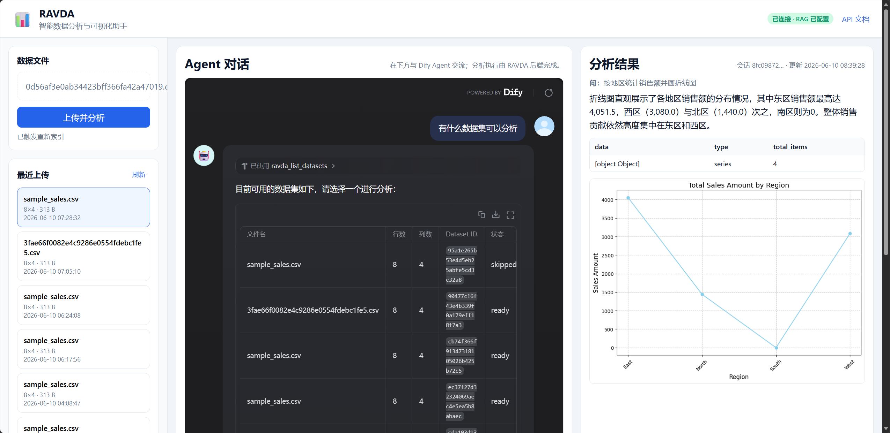
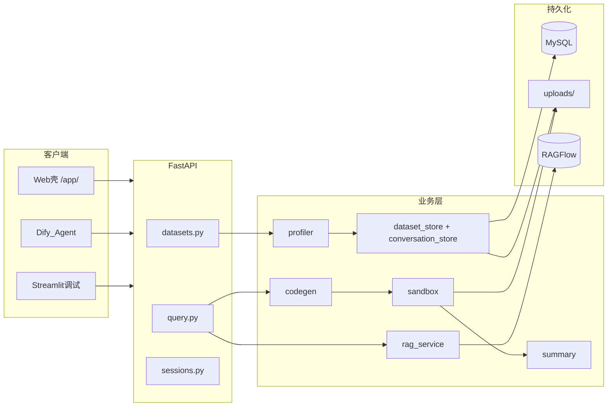

# RAVDA：让数据自己开口说话


## 为什么做这个项目

我做过不少数据分析相关的事，也帮别人看过报表。一个反复出现的场景是：对方明明有一份整理得不错的 CSV 或 Excel，却卡在「不知道怎么用代码分析」这一步。会 Excel 不等于会 Pandas，更不等于会 Matplotlib。每次从零写脚本、调图表、解释结果，时间成本都不低。

我想做一个**能听懂人话的数据分析助手**：用户上传数据文件，用自然语言提问，系统自动生成并执行分析代码，返回统计结果、可视化图表和中文结论，还能像聊天一样多轮追问——比如先出柱状图，再说一句「换成折线图」。

这就是 **RAVDA**（**R**etrieval-**A**ugmented **V**isual **D**ata **A**ssistant）——基于 RAG 的智能数据分析与可视化助手。

## 项目简介

RAVDA 面向「上传 → 提问 → 分析 → 可视化」的完整链路：

1. 上传 CSV / Excel，系统自动生成数据画像并入库
2. 用自然语言提问，系统生成 Pandas 代码并在沙箱中执行
3. 返回表格、图表（Base64 PNG）和 2–3 句中文结论
4. 支持多轮追问，会话持久化到 MySQL，服务重启后仍可继续

相同内容的文件会通过 SHA-256 内容哈希自动去重，侧栏可快速切换最近上传的数据集，不必重复上传。



如上图所示，Web 壳采用三栏布局：

- **左栏**：上传 CSV/Excel、最近数据集列表、RAG 索引状态、复制 `dataset_id`
- **中栏**：嵌入 Dify Agent，作为唯一对话入口
- **右栏**：轮询最新会话，展示中文结论、表格与图表（不展示代码，面向业务用户）

## 技术架构



| 层级 | 技术 |
|------|------|
| 后端 | Python 3.11、FastAPI、Uvicorn |
| 数据处理 | Pandas、NumPy、Matplotlib、OpenPyXL |
| 持久化 | MySQL 8.x（画像、会话、内容哈希去重） |
| LLM | OpenAI 兼容 API（代码生成 + 中文结论） |
| RAG | RAGFlow 0.19.x + `ragflow-sdk` |
| 对话编排 | 自托管 Dify Agent（HTTP 自定义工具） |
| 前端 | 静态 Web 壳 `/app/` + 可选 Streamlit 调试入口 |

**持久化分工**：

| 数据 | 存储位置 |
|------|----------|
| 原始 CSV/Excel | `uploads/{dataset_id}.ext` |
| 数据集元数据 + 画像 JSON + 内容哈希 | MySQL `datasets` 表 |
| 会话与查询历史 | MySQL `conversation_sessions` / `conversation_turns` 表 |
| 向量索引 | RAGFlow 知识库 `ravda-{dataset_id}` |

## 核心查询链路

一次自然语言提问，后端大致走以下流程：

> 读库画像 → RAG 检索（可降级）→ 加载会话历史 → codegen 生成代码 → AST 沙箱执行 →（失败时）ReAct 重试 → 中文 summary → MySQL 持久化

配置 `OPENAI_API_KEY` 后优先使用 LLM 生成 Pandas 代码；执行失败时，系统会将 error、原代码和数据画像反馈给 LLM，按 `MAX_RETRIES` 自动修正重试。未配置 Key 时走内置规则引擎，功能可用但无 LLM 重试。

RAG 的角色是**语义补充**，不是替代分析引擎：检索到的字段说明、业务语义会注入 codegen 的 prompt，帮助模型理解「销售额」「GMV」这类别名；数值统计仍以数据画像（Profile）为准。RAGFlow 不可用或索引未就绪时，系统会降级跳过检索，不阻断 `/query`。

## 功能亮点

**内容哈希去重**  
上传时对文件内容计算 SHA-256，相同文件不会重复入库，响应中会标记 `deduplicated: true`，节省存储和索引成本。

**AST 沙箱执行**  
LLM 生成的代码在 AST 沙箱中运行，只允许安全的 Pandas / Matplotlib 操作，从 DataFrame 读取数据，避免任意系统调用。

**ReAct 重试**  
代码执行失败时，将错误信息、原代码和列画像一并反馈给 LLM，自动修正后重试，最多 `MAX_RETRIES` 轮（默认 2，最多 3 轮执行）。

**多轮对话**  
会话与 `dataset_id` 绑定，持久化到 MySQL。首次查询返回 `session_id`，追问时传入即可——例如「换成折线图」「只看华东区」，历史轮次会注入 LLM prompt。

**RAG 语义补充**  
上传后后台将数据画像 Markdown 和原始表索引到 RAGFlow；查询前检索相关片段注入 codegen，提升对字段别名和业务语义的理解。

**Dify Agent 编排**  
对话层交给 Dify，分析执行层交给 RAVDA。Agent 通过 HTTP 自定义工具调用 `/api/v1` 接口，Web 壳嵌入 Dify chatbot iframe，右侧实时展示分析结果。

## 开发过程中的踩坑

**RAGFlow 客户端选型**  
早期用 `httpx` 直连 `RAGFLOW_BASE_URL`，经常拿到 502 空响应。改用 `requests` 和官方 `ragflow-sdk==0.19.0` 后稳定许多。SDK 实际请求 `{RAGFLOW_BASE_URL}/api/v1/...`，鉴权头为 `Authorization: Bearer <key>`。

**Dify 导入 OpenAPI**  
Dify 无法正确解析 FastAPI 默认的 `/openapi.json`（OpenAPI 3.1 + `$ref`），会报 invalid schema。解决方案是提供专用子集 `/openapi-dify.json`（OpenAPI 3.0），或手动粘贴 `scripts/dify_openapi.json`。`multipart` 上传接口仍需在 Dify 里手动补一条 `POST /api/v1/datasets/upload`。

**Docker 内网络与超时**  
Dify 跑在 Docker 里时，容器内不能用 `127.0.0.1` 访问宿主机上的 RAVDA，须用 `http://host.docker.internal:8000`。另外 `/query` 链路较慢，Dify 的 `SSRF_DEFAULT_*_TIME_OUT` 建议调到 120 秒以上，否则工具调用容易超时。

## 快速体验

**1. 准备环境**

```powershell
conda env create -f environment.yml
conda activate ravda
pip install -r requirements.txt
copy .env.example .env
# 编辑 .env：至少配置 MySQL；可选配置 OPENAI_API_KEY、RAGFLOW_*、DIFY_EMBED_URL
```

**2. 启动后端**

```powershell
cd c:\Python_Project\RAVDA
uvicorn app.main:app --reload --host 0.0.0.0 --port 8000
```

**3. 打开 Web 界面**

浏览器访问 [http://127.0.0.1:8000/app/](http://127.0.0.1:8000/app/)，上传 CSV/Excel，在 Dify 对话区用自然语言提问。API 文档：[http://127.0.0.1:8000/docs](http://127.0.0.1:8000/docs)

**命令行快速验证**

```powershell
# 上传测试数据
curl -X POST "http://127.0.0.1:8000/api/v1/datasets/upload" -F "file=@tests/data/sample_sales.csv"

# 自然语言查询（将 DATASET_ID 替换为上传返回的 dataset_id）
curl -X POST "http://127.0.0.1:8000/api/v1/datasets/DATASET_ID/query" ^
  -H "Content-Type: application/json" ^
  -d "{\"question\": \"按地区统计销售额并画柱状图\"}"
```

响应中包含 `summary`（中文结论）、`result`（表格/数值）、`charts`（Base64 图表）和 `session_id`（用于多轮追问）。

## 当前进度与展望

**已完成**

- 数据上传、Pandas 画像、MySQL 持久化与内容去重
- 自然语言查询全链路：codegen → 沙箱执行 → ReAct 重试 → 中文结论
- 多轮会话 API 与 Web 结果面板轮询
- RAGFlow 检索集成（上传后后台索引，查询前语义补充）
- 静态 Web 壳（Dify iframe + 侧栏 + 结果面板）
- Dify Agent 自定义工具接入（`openapi-dify.json`、连通性测试脚本）
- Streamlit 调试前端（可选）

**计划中**

- Coze 工作流编排
- Dify Agent 预置工作流与提示词模板

## 写在最后

RAVDA 是我把「大模型 + RAG + 低代码编排 + 传统数据分析」串成一条可用链路的实践。它不是一个完美的 BI 替代品，但在「快速上传、自然语言探索、自动出图出结论」这个场景里，已经能实实在在地省时间。

如果你也对这类 AI 数据分析助手感兴趣，欢迎到 GitHub 看看源码、提 Issue 或交流想法：

**[https://github.com/Scatt-wind](https://github.com/Scatt-wind)**
