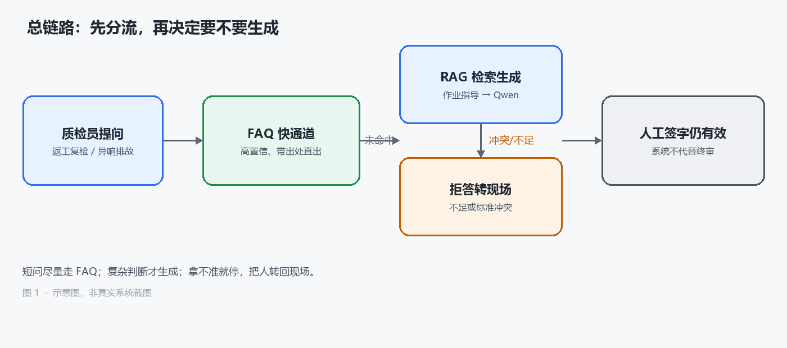
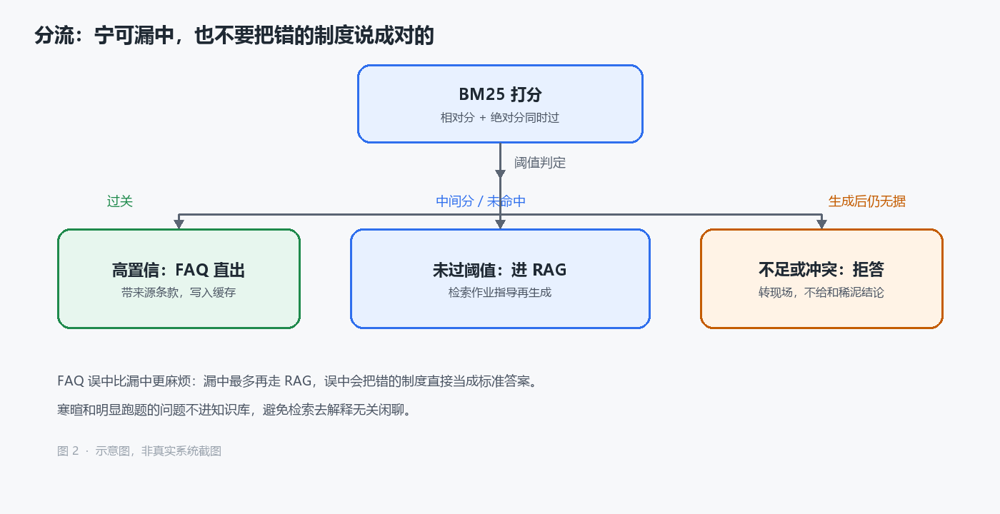
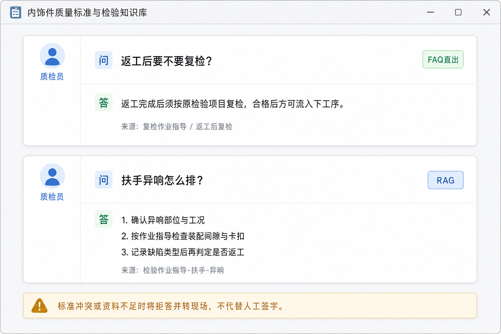

质检岗问系统的问题和问搜索引擎不一样。现场时间紧，答错也不只是再搜一次。隔离、返工、复检后面跟着记录和签字。系统如果随口补一个标准值，责任最后还是落在人身上。

我这段时间做的是内饰件质量标准与检验知识库问答。短问要稳，复杂判断要能指出处。拿不准就把人转回现场。它是辅助工具，不代替人工签字。

## 现场其实有两类问题

第一类短，问法几乎固定。「返工后要不要复检？」「隔离品能不能先入库？」班组长一天能问十几遍，答案在制度里本来就有。这类题每次都跑大模型，慢，还容易把措辞说飘。现场要的是一句能对上作业指导的话，不是一段通顺的解释。

第二类长，而且带着工况。「扶手异响怎么排？」「C 柱间隙超差，先查哪一项？」标准往往拆在几份文件里：作业指导写步骤，缺陷判定写等级，测量方法写量具和取样。人要看的是依据哪条、先做什么、做到什么算过。

两类问题如果走同一条生成链路，短问不稳，长问没有据。质检记录还要人签字。系统再快，也不能变成「模型说了就算」。后面所有拒答、转人工、带来源，都是在给签字留退路。

## 先分流，再生成

问题进来，先走 FAQ 快通道。问法和库里的标准问足够像、分数过关，直接返回已经核对过的答案，并带上出处。过不了再进 RAG：检索作业指导、缺陷判定这些文档，用 Qwen 按检索到的内容组织回答。

资料不够，或者两份仍有效的标准说法打架，就拒答，提示转现场。生成模型没有终审权。

FAQ、检索、生成是串起来的。技术栈是 Python、LangChain、BGE-M3、Qwen、Milvus、MySQL、BM25。框架没那么值得展开。后来花时间最多的是失败出口：FAQ 可以不中，检索可以返回空，生成可以拒绝作答。我更怕系统很流畅地给出一句错的，而不是它偶尔沉默。

## 文档怎么切，决定后面会不会串件

知识源按现场制度收：隔离、返工、复检、缺陷判定。PDF 为主。切的时候按标题和章节走，表格尽量整表留下。公差、判定等级、抽检频次经常挤在同一张表里。切开之后，模型只能看到「上限」或者「抽检」，中间的数字丢了，后面再老实也补不回来。

一部分作业指导是扫描件，表在图里。纯文本抽出来是空的或乱码，这类页要走 OCR，再按章节切。OCR 会把公差读错，所以进库前抽过几页人工核对，数字对不上就当这页不可用，宁可不检索到，也不把 0.5 读成 5。

切块用 Parent-Child。小块进向量库，用来命中「C 柱间隙超差」这种条款级说法；命中后再把对应的大块送给模型，里面才有测量方法、判定步骤。整篇做成一个向量，检索会糊。切得太碎，模型只能看到半句判定。最后大约 2000 个 chunk。

内饰件还有一个脏问题：零件名太像。扶手和头枕、C 柱和 D 柱，文档句式差不多，embedding 很容易串。我在每块上打了零件、文种、缺陷类型。检索时先按这些字段收窄，再比相似度。这一步把跨零件误召回大概压掉了 40%。没有它，后面再重排也是在一堆错件里挑。

元数据早期基本是手打的。文种还好办，目录结构比较清楚。零件和缺陷得从标题、页眉、正文里抽。错标比不标更麻烦，我会宁可标成「未分类」也不乱贴。未分类的块会进更宽的召回，再用重排往下压，总比扶手的块被标成头枕要好。

## FAQ 阈值宁可不中，也不要错中

短问用 BM25 做词面匹配。FAQ 的问法重复，关键词靠得住。「返工」「复检」「隔离」这些词，在标准问里很少被同义改光。向量检索在这里并不占优：它太容易把「要不要复检」和「复检不合格怎么办」拉得很近。

标准问从哪来？一部分摘自作业指导里已经写死的条款问答，一部分是跟班组长对过的口头高频问。后者更脏，同一件事能有四五种说法，我没有把它们全收成独立答案，而是归到同一条标准问下面，避免库里自己打架。

阈值我故意收紧。只用相对分会出一种坏情况：所有候选都很差，第一名看起来仍很突出，系统当成命中。所以相对分和绝对分要同时过。过不了就当没中，把问题交给 RAG。

命中后的答案进 Redis，同一句标准问不必反复打库。线上 FAQ 命中准确率到了 92% 以上，误中压在 3% 以内。这两个数字里，我更盯误中。漏中最多慢一点，误中会把错的制度说成对的。

FAQ 后面还有一道很轻的分类。寒暄、明显跟质检无关的问题，不进知识库。检验、返工、隔离、缺陷这类才继续。免得检索去解释「今天天气怎么样」。

分类会错。把专业问题判成闲聊，会直接空答，这个比把闲聊送进检索更糟。所以这道门偏保守：模棱两可的，按专业问题处理，大不了多检索一次。

## 复杂问题怎么检索

过了 FAQ 的问题，语义往往和文档对不齐。质检员说「异响怎么排」，作业指导写的是「异常噪声排查步骤」和一串检查项。原句去搜，经常碰到标题对、步骤不对，或者步骤对、零件不对。

嵌入用 BGE-M3，向量库存 Milvus。BGE-M3 一次能出稠密向量和稀疏向量。稠密管说法不一样但意思近的情况，稀疏管条款里必须对上的词，比如零件名、缺陷名。两路召回再用 RRF 合成一份名单。RRF 不需要两路分数在同一量纲上可比，比拍脑袋做加权省事。名单出来后，用 CrossEncoder 重排。它吃的是问题和文档成对打分，比只比向量距离更适合把扶手和头枕分开。

不是所有问题都拿原句检索。问法太短的，比如「扶手异响怎么排」，我会先让模型写一段假设的排故过程，用这段更像文档的文字去搜。假设答案里会出现「确认工况」「检查卡扣与装配间隙」「记录缺陷类型」这类作业指导里的词，召回会稳一些。HyDE 在这里有用，是因为现场口语短，文档书面长。一问里绑了两件事，比如扶手异响和头枕异响一起问，就拆成两条子查询分别检索，再合并去重。问法绕太远的，先收成一个更好检索的单句。这个用得少，当作兜底。

策略选错的代价是多一次模型调用。简单事实题默认直接检索。策略模块挂了，也回退到直接检索，不能因为这一跳失败就整段停。

检索结果为空时，我不让模型凭经验补。空就是空，后面会走到拒答。通识问答空一点，用户顶多觉得你笨；质检空一点却硬答，用户会拿去填记录。

## 生成侧把「不能越界」写进规则

检索到的内容交给 Qwen 时，规则写得很死。

只依据当前检索到的资料回答。标准值、判定等级、抽检要求必须按原文，不许用模型记忆补。回答里要带来源，比如哪份作业指导的哪一节。资料不足以支撑结论，或者两份有效标准说法冲突，就明确说无法判定，转给现场，不要给一个「通常可以」。

系统面对的是质检员和班组长，不是对外客服。用语跟现场走：隔离、返工、复检、让步接收，这些词不要被同义替换成更「好懂」的白话。替换完，记录对不上。

Prompt 里写规则不够硬。空检索、冲突提示、拒答话术是后处理，不指望模型每次都自觉。

冲突比不足更难处理。不足至少干净：库里没有，就说没有。冲突是两份文件都像那么回事，一份写返工后全检，一份写抽检。这种时候生成一个折中方案最危险，因为它读起来最像专家。我的处理很笨：把冲突摊开，列出两边出处，结论写成「系统无法判定，请按现行有效版本或现场工艺确认」。不替人做版本选择。

上图是示意图。短问走直出，复杂问走检索；无论哪条路，来源都要看见。底下那句拒答提示是给签字的人看的。

## 120 道题怎么把准确率从 75% 打到 88%

上线前做了 120 道题，覆盖该走 FAQ 的短问、该走 RAG 的复杂判断、该拒答的不足和冲突。题不是我一个人编的。有几道我以为该走 RAG，现场质检员说这是每天都问的，应该进 FAQ。也有几道我写得很完整，他们说没人会这么问，口语更短、更冲。

对错怎么判：FAQ 看是否命中正确标准问；RAG 看出处零件对不对、有没有编造数字、步骤能不能在原文里找到；拒答看该不该停。第一轮整体准确率大约 75%。错的并不平均。

FAQ 误中几道，都是两个标准问共用了「复检」这类高频词，相对分被顶上去。后来把绝对分门槛再抬一点，并给容易混的条目补了更完整的问法。比如把「要不要复检」和「复检不合格怎么办」拆开，不要共用一个过于短的标准问。

RAG 这边更碎。问扶手，上下文里混进头枕，ContextPrecision 掉得很快。上下文没有某个判定值，答案里却出现了数字，Faithfulness 会打脸。资料是对的，回答写成了通用排故说明，AnswerRelevancy 就差。该看的测量方法没召回来，ContextRecall 低，后面生成再老实也答不全。

这些指标不是为了写进汇报。串件就去收元数据和重排；胡编就收紧 Prompt 和拒答；跑题就改成必须围绕当前问题、带出处；漏检就查切块和召回，而不是先怪模型。

有一轮我把召回条数加大，ContextRecall 好看了，ContextPrecision 马上掉。答案更长，夹进更多不相干条款，现场更烦。后来还是把条数收回去，把力气花在零件过滤和重排上。120 道谈不上全面，但它足够拦住「指标好看、现场更乱」。

上线后真正问得最多的还是 FAQ。RAG 量不大，但那部分一旦错，班组长记得住，他们不会跟你讨论 Recall，只会把那次错答当例子反复提。冲突题最难出，因为要故意找「两份标准都还有效」的材料，现场不太愿意把未归档的旧版拿出来对。

改了几轮阈值和 Prompt 之后，整体准确率到了 88%。剩下的多半是边界题：标准本身在修订，或者现场描述太口语，文档里根本没有对应句。这类我更愿意拒答，不愿意猜。

拒答本身也要算准确率。早期有几道本该拒的题，模型给了很圆的「建议」。从流畅度看没问题，从现场看是事故。后来我把拒答成功也算对，把「该拒却答了」单独记。否则准确率会被健谈的错误答案抬上去。
