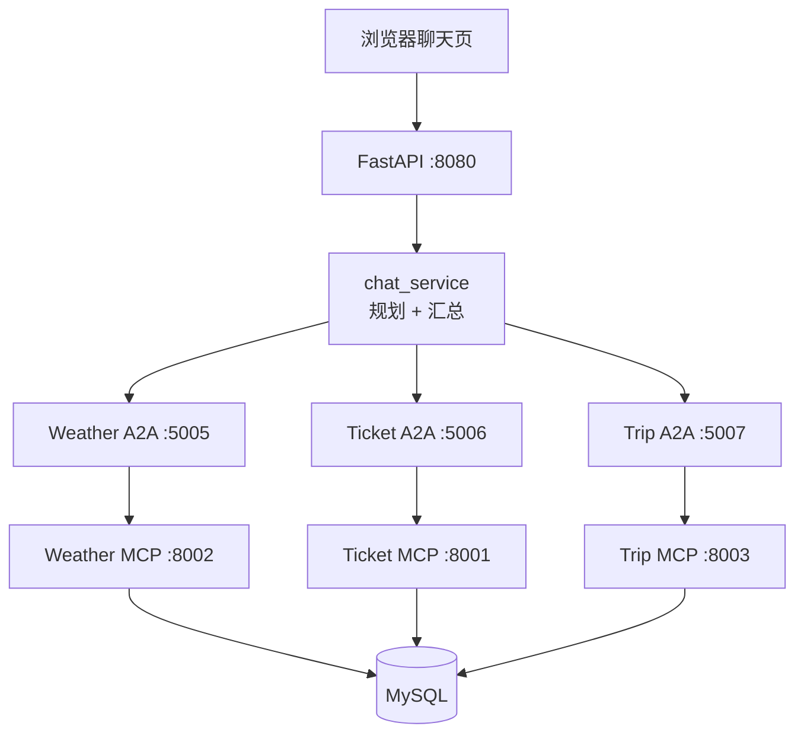
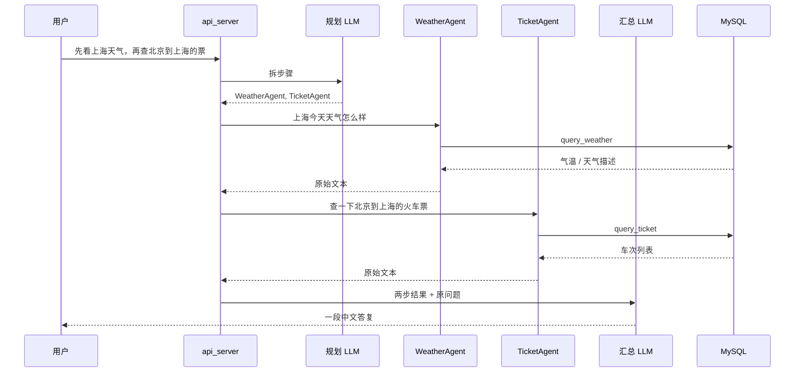
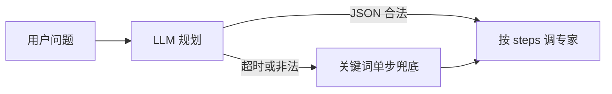

工作里要给同事演示「多 Agent 协作」。对方要看到的不是一个会聊天的页面，而是一句话被拆开、分给几个专家、各自查完库、再合成一段人话。

我拿旅行场景做了最小能跑的一版：查天气、查火车票、搜景点、订一张票。选旅行不是因为它好听，是因为这几件事边界清楚。天气只问城市，票只问出发地和目的地，景点用关键词搜，订票再多一个乘客名。三个角色往上一摆，听众不用先学业务。

数据在 MySQL，模型用本机 Ollama 的 `qwen3.5:4b`。向量库、缓存、登录都没接。会议室里能把链路走通，就算交差。下面写当时为什么这么拆，以及演示时真正管用的几处。

## 谁说话，谁干活，谁碰库

很多人把 Agent 理解成「每个角色背后都挂一个大模型」。我没这么做。

整条链路分三层。规划层和汇总层才调 LLM。三个专家 Agent（天气、票务、旅行服务）只负责从问句里抠参数、把任务发出去。真正碰 MySQL 的是 MCP 服务。



A2A 管的是「把任务交给哪个专家」。MCP 管的是「这个专家能调哪些工具」。两者叠在一起，多一跳，看起来啰嗦。演示时反而好讲：上面一层是角色，下面一层是工具，数据库只出现在最底下。同事指着图问「能不能少一层」，我的回答是能。`chat_service` 直接调三个 MCP，功能一样。少掉的是「专家」这个可单独启动、可单独挂掉的进程。演示要的就是这层，不是最短路径。

LLM 只出现在 `chat_service.py` 里，两处。一处把用户那句话拆成 `steps`；另一处把各专家返回的原始文本收成一段中文。专家进程里没有模型调用。同事问「天气 Agent 会不会胡编气温」时，我可以直接说不会，它只查表。规划层胡编的是「该喊谁」，喊错了你能在日志里看见；气温这种数，模型碰不到。

三个 MCP 各自暴露很少的工具。天气是 `query_weather(city, date)`，票务是 `query_ticket(from_city, to_city)`，旅行服务这边是搜景点 `search_attraction`，以及写订单的 `order_ticket`。订票挂在旅行服务上而不是票务 Agent 上，因为查余票和真正下单我想分开：一个只读，一个写库。查票失败不该留下半截订单；下单失败也不该让查询接口背锅。

用户入口是 FastAPI 挂的一个静态聊天页，端口 8080。没有登录，没有会话列表。打开就能打字。这够演示，也意味着任何能访问这台机器的人都能订一张「张三」的票。第一版接受这个风险。

## 用一句真实的话走一遍

演示时我常用这句：

> 先看上海天气，再查北京到上海的票

规划层被要求只吐 JSON，不要解释。prompt 开头写了 `/no_think`，是因为 qwen 这类模型喜欢先想一长段再给答案，那段思考会把 JSON 解析搞崩。正常情况下输出长这样：

```json
{
  "steps": [
    {"agent": "WeatherAgent", "query": "上海今天天气怎么样"},
    {"agent": "TicketAgent", "query": "查一下北京到上海的火车票"}
  ]
}
```

`agent` 只能是三个名字之一。`query` 必须是可以原样转发给专家的完整问题，城市、出发地这些得带着，不能写成「查一下刚才那个」。规划器如果输出 Markdown 代码块，解析前会先剥一层围栏；剥完还不是对象、`steps` 为空、或 agent 名字不在白名单里，就算失败。

后面的时序没有魔法，就是按 `steps` 顺序调：



天气 Agent 收到 query 之后，用正则抽出「上海」，再调 MCP。没有 prompt，没有二次理解。票务那边抽的是「北京」「上海」。两边都查完，汇总层才看到两段原始结果。汇总的要求很短：直接回答用户，某步失败就直说，不要报内部 Agent 名字，不要把表里的原始行原样堆上去。

聊天页上，这句话发出去之后会先出现「正在思考」，接着「正在分配 Agent：天气 Agent、票务 Agent」，然后分别是「正在调用天气 Agent」「天气 Agent 已完成」，票务同理，最后「正在整理回复」，字一个一个出来。同事盯着状态看，比盯着空白输入框有用。

多步是规划层的事，专家之间不对等互调。第一版如果做成 Agent 互相喊，演示时出了错很难指出是谁的问题。现在出错，看 `steps` 停在哪一步就行。串行也慢一点。会议室里，慢可以解释，错找不到人解释不了。

## 三个当场就得拍板的决定

### 专家不用模型

天气 Agent 的核心就这几行：从任务文本里拿城市，调工具，把返回值塞进 A2A 的 artifacts。失败也写成一段文本，不抛到进程外。进程还在，任务状态是完成，内容是「错误: ……」。调用方按文本处理就行，不用再解析一套失败协议。

```python
def handle_task(self, task):
    try:
        query = (task.message or {}).get("content", {}).get("text", "")
        city = extract_city(query)
        if not city:
            raise ValueError("无法从问题中解析城市")

        mcp_client = MCPClient(server_url=MCP_WEATHER_URL)
        result = asyncio.run(mcp_client.call_tool("query_weather", city=city))

        task.artifacts = [{"parts": [{"type": "text", "text": str(result)}]}]
    except Exception as e:
        task.artifacts = [{"parts": [{"type": "text", "text": f"错误: {e}"}]}]
    return task
```

城市名单是写死的：北京、上海、广州、深圳、杭州、成都、西安、南京。`extract_city` 找问句里最先出现的那个。「北京到上海」会先命中北京，所以天气问句里如果两个城市都出现，可能抽错。演示用例避开了这种问法。订票再多抽车次号（`G123` 这种）和乘客名。这套东西在开放域会立刻不够用，演示够了。同事关心的是「专家层可以不烧 token」，不是中国有多少地级市。

专家不用模型，还有一个具体后果：规划错了，你看得到。规划把「帮我订一张北京到上海的票，乘客张三」派给了只负责查询的 TicketAgent，订单表不会出现脏数据。写库只发生在 TripAgent 走到 `order_ticket` 的那条路上。边界是代码写死的，不是模型临时发挥的。

### 规划失败就降级，别让演示停住

本机 4B 模型偶尔会在 JSON 外面加一段话，偶尔会超时。规划限了 15 秒。超时、空结果、字段不合法，一律走关键词兜底：问句里有「天气」就 WeatherAgent，有「订票」「预订」「下单」就 TripAgent，有「票」就 TicketAgent，其余算旅行服务。判断顺序有意把订票放在「票」前面，不然「订一张票」会被查票逻辑先吃掉。兜底永远只返回一步，保证后面还能调通。



前端会看到一句「规划较慢，已改用快速路由」。我没有把这句话藏起来。演示时模型卡一下很常见，让观众知道系统还在工作，比转圈圈有用。有一次规划吐出来的 JSON 里 agent 写成了小写，校验直接判失败，走了兜底。当时我还以为是网络问题，后来才在解析函数里看到白名单是按字符串精确比的。

兜底当然会拆错。一句里既要天气又要票，关键词方案只会走一个 Agent。这是接受的：完整拆分依赖规划成功；规划挂了，至少还能回答一半，总比整页报错好看。

### 页面上要能看见系统在干活

第一版只有 `POST /chat`，请求发出去之后聊天页一直空着，等规划、等两个 Agent、再等汇总。本机模型偏慢时，这十几秒像死机。有人已经伸手去刷新了。

后来加了 `POST /chat/stream`，用 SSE 往外推状态。顺序大致是：正在思考 → 正在分配 Agent → 正在调用某个专家 → 已完成 → 正在整理回复，然后逐 token 吐最终答复。非流式的 `/chat` 还留着，curl 验收用它更省事。

Windows 上还遇到过首包太小，代理或浏览器把事件攒住不往页面送。处理办法很土：每条 SSE 后面垫 2KB 空格注释。少了它，状态推不出去；有了它，响应体变胖，但演示电脑上终于能看见「正在调用」。这种补丁我不打算写成经验，它只说明流式接口在本机 Windows 上也会被缓冲坑到。

MySQL 挂掉时，接口返回 `{ ok: false, error: "..." }`，不抛 500。三个专家如果都回报连接失败，汇总层不再试图把错误写成「今天天气不错」。判断办法是看返回文本里有没有「MySQL 连接失败」「查询失败」这类标记。演示里有人会随手停数据库，这条必须当场成立。

## 为了能跑起来，砍掉了什么

启动是七个进程：三个 MCP，三个 A2A，再加 API。顺序不能乱，MCP 要先起来，A2A 才能连工具。没有 docker-compose，没有进程守护。这是演示成本，每次开电脑都要过一遍端口表。哪个没起，页面上就是某个 Agent 连接失败，或一直转。README 里写了用 curl 探 `/mcp` 和 `/a2a/agent.json`，我自己也是靠这个查的。

没有多轮记忆。每一句都当新问题。规划 prompt 要求 `query` 自包含，就是因为下一句看不到上一句。同事如果接着问「那票多少钱」，系统不会记得刚才查过北京到上海。它可能会再规划一次，也可能兜底到旅行服务，答非所问。我会在演示前说清楚：请一句里把要的东西说完。

订票只往本地 `ticket_order` 插一条记录，不做支付，也不对接任何票务平台。种子数据是北京、上海这几条天气、车次和景点，够把验收用例走完。景点检索是 SQL 关键词，不是向量。第一版规格里写了不接 Milvus，我按这个做的。同事如果问「语义搜索呢」，答案是这版没有。

专家之间不对等互调。天气 Agent 不会自己去喊票务。需要两步时，由规划层排好顺序，API 串行执行。并行我在脑子里排过：两个只读查询可以一起发。第一版没做。串行更好指错，会议室里这点更重要。

第一版的目标是把分层讲清楚。进程编排、会话、真实订票，每一项单独都够再做一个项目。我没有把它们写进当前仓库的待办里假装下一周就做。

## 同事看完能留下什么

他们不需要记住端口号。需要留下的是这张图：一句话进规划，规划只输出该喊谁；专家不编数据，只调工具；工具下面才是库。模型出现两次，一次拆活，一次把结果说成人话。

若继续做，我会先把七个进程收成一条启动命令。再加第四个 Agent 之前，先让现有三个在别人的机器上也能五分钟拉起来。分层已经能讲完了，缺的是别人不用看着我敲命令。
